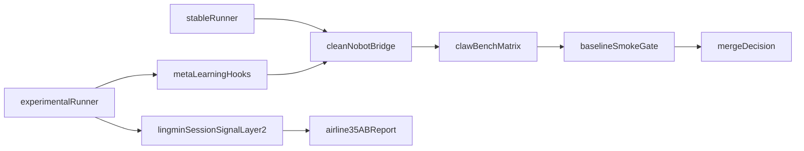

# DeskClaw × Lingmin 联合修复计划（Hybrid）

## 目标与原则
- 第一优先级是让干净 Nobot 可稳定跑 claw-bench 能力矩阵。
- 实验能力必须与稳定评测入口彻底隔离，默认路径不感知 meta-learning。
- 仅剔除 `72f44be95ff73683cd81f80c706e39b8193a8f35` 中与 meta-learning A/B 强相关部分，保留 HAL/skills 等非 meta 改动。

## 阶段一：强清理恢复基线（立即执行）
- 在 [`/Users/yumeng/Documents/Projects/DeskClaw-Arena/src/eval/nobot_openai_bridge.py`](/Users/yumeng/Documents/Projects/DeskClaw-Arena/src/eval/nobot_openai_bridge.py) 清理 forced meta-learning 注入路径：
  - 去除/禁用 `force_meta_learning`、`force_layer2_every_tasks` 及对应 pre/post/layer2 调用链。
  - 去除 `/v1/task` 中对 prompt 的 meta 预注入和 `meta_forced_*` 返回字段。
  - 去除相关 CLI 参数（`--force-meta-learning`、`--meta-config`、`--meta-workspace`、`--force-layer2-every-tasks`）。
- 保留非 meta 能力：HAL chat completion 路径、skills_mode、并行评测与报告功能。
- 在 [`/Users/yumeng/Documents/Projects/DeskClaw-Arena/src/eval/plan_v2_runner.py`](/Users/yumeng/Documents/Projects/DeskClaw-Arena/src/eval/plan_v2_runner.py) 保持 stable 路径仅依赖干净 bridge，不传任何实验开关。

## 阶段二：隔离重建实验入口（独立提交）
- 新建实验 hooks 模块（例如 `src/eval/experimental/meta_learning_hooks.py`），把 meta-learning 逻辑封装为可选插件，不回灌 stable bridge 主路径。
- 在 [`/Users/yumeng/Documents/Projects/DeskClaw-Arena/src/eval/plan_v2_runner.py`](/Users/yumeng/Documents/Projects/DeskClaw-Arena/src/eval/plan_v2_runner.py) 分离 `stable` 与 `experimental` 子命令：
  - `stable`: 默认能力矩阵入口，零 meta 注入。
  - `experimental`: 显式启用 hooks 与实验配置。
- 增加实验配置文件（如 `configs/eval/ab_meta_learning.yaml`），将端口、bridge URL、meta 开关全部配置化，禁止再通过改核心代码启用实验。

## 阶段三：lingmin 链路修复（与阶段二并行可控推进）
- 按 airline35 既定顺序先修 session：
  - 对齐 `sessions_root` 与真实落盘路径；会话未命中时阻断 taxonomy 生成，避免 `Session not found` 污染。
- 增加 trace 与可观测性：每轮记录 pre/post/layer2 与 bridge 标记。
- 在 session 可靠后再升级 signal 与 LLM I/O（fallback_reason、解析失败审计），最后再调 Layer2 门槛。

## 验证与门禁
- 基线验证（DeskClaw-Arena）：
  - stable 路径跑能力矩阵，确认无实验参数时结果与历史基线在噪声范围内。
  - 进程与命令行审计：不得出现 forced meta 参数。
- 隔离验证：
  - experimental 仅在显式配置下生效，且不影响 stable 运行结果。
- 业务验收（airline35）：
  - A/B 各 10 轮；taxonomy 不再被 `Session not found` 主导；A 组能稳定产出可执行指导。

## 里程碑产物
- M1（基线恢复）：可直接运行的干净 Nobot stable 命令与一次通过的能力矩阵结果。
- M2（隔离重建）：stable/experimental 双入口与实验配置文件。
- M3（链路闭环）：airline35 A/B 10 轮趋势与归因报告（trace + 产物 + 结论）。

## 实施关系图

