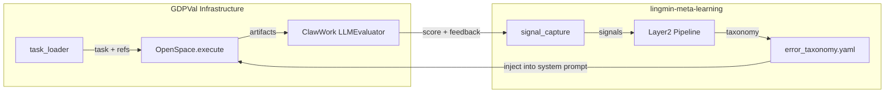

# GDPVal Meta-Learning 验证方案

## 为什么 GDPVal 比 tau-bench 更适合

- **消除用户模拟器随机性**：Agent 独立执行任务产出 artifact，没有对话对手
- **连续评分**（0-10）：55 项 rubric 条目 vs tau-bench 的二值 reward
- **自然聚类**：6 个 occupation 各有 2 个任务，天然支持跨任务迁移实验
- **已有评估协议**：ClawWork LLMEvaluator + 职业级 meta_prompt rubric

## 架构集成



**关键集成点**（不修改 OpenSpace 核心代码）：
- `OpenSpaceConfig.grounding_system_prompt`：追加 taxonomy 到 agent 系统提示
- `LLMEvaluator.evaluate_artifact` 的 feedback 文本：作为 meta-learning 信号源
- `task.rubric_json`：执行后的逐项得分对比（评估 taxonomy 是否帮助了特定维度）

## 信号提取设计

从 GDPVal 评估结果提取 meta-learning 信号：

```python
# 信号来源（agent 可观测数据）
signal = {
    "task_description": f"[gdpval][{occupation}] {prompt[:200]}",
    "errors_encountered": [feedback_text],  # LLM evaluator 反馈
    "resolution_snapshot": f"score={score}/10, payment={payment}",
    "tools_used": tool_call_names,
    "user_corrections": extract_rubric_dimension_failures(feedback),
    # rubric 维度失败 → 策略层反馈
    # e.g. "completeness: missing required PDF output"
    #      "correctness: citations not tied to relevant questions"
}
```

信号中**不包含** rubric_json 原文（那是答案），只包含评估器反馈中的策略层模式。

## 实验设计

### 实验 1：跨任务迁移（核心验证）

6 个 occupation pair，每对 2 个任务：

| Occupation | Task A (训练) | Task B (测试) |
|---|---|---|
| Compliance Officers | VASP 风险测试 | 联邦拨款风险评估 |
| Buyers and Purchasing Agents | 汽车零部件采购 | 第二采购任务 |
| Administrative Services Managers | 任务 1 | 任务 2 |
| Audio and Video Technicians | 任务 1 | 任务 2 |
| Accountants and Auditors | 任务 1 | 任务 2 |
| Child/Family Social Workers | 任务 1 | 任务 2 |

每对的执行流程：

```
1. Run Task B (cold, no taxonomy)  → score_control
2. Run Task A (cold)               → score_A + eval feedback
3. Signal capture + Layer2          → taxonomy
4. Run Task B (with taxonomy)      → score_treatment
5. Compare: score_treatment vs score_control
```

先跑 B 的 control 组，避免顺序污染。

### 实验 2：同任务迭代改进（补充验证）

选 2 个任务各跑 3 轮：

```
Round 1: no taxonomy  → score_1 + signal
Round 2: with taxonomy from round 1 → score_2 + signal
Round 3: with updated taxonomy      → score_3
预期: score_1 < score_2 ≤ score_3
```

### 对照组

- **Baseline**: OpenSpace 原版 skill_engine（Phase 1 → Phase 2）
- **Treatment**: 关闭 skill_engine，使用 meta-learning taxonomy
- **Control**: 无任何增强（既无 skill_engine 也无 taxonomy）

## 实现方案

### 核心脚本

**`scripts/gdpval_meta_test.py`** — 独立的实验 runner：

- 复用 `gdpval_bench/task_loader.py` 加载任务
- 复用 `ClawWork/livebench/work/llm_evaluator.py` 评估
- 用 `OpenSpace.execute()` 执行任务（通过 `OpenSpaceConfig` 控制 system prompt）
- 调用 `meta_learning.mcp_server.capture_signal` 和 `run_layer2`
- 用 `_build_meta_context()` 构建注入文本

### 需要的新代码

1. **`scripts/gdpval_signal_adapter.py`** — 将 GDPVal 评估反馈转换为 meta-learning 信号格式
   - 从 evaluator feedback 提取策略层失败模式
   - 映射 rubric 维度（completeness/correctness/quality/domain）到信号类型
   - 过滤参数层细节，保留可迁移的策略模式

2. **修改 `src/meta_learning/shared/llm_openai.py`**
   - `materialize_signal` prompt 支持 GDPVal 职业任务（不仅限于 customer_service）
   - `extract_taxonomy` prompt 适配文档产出类任务模式

3. **实验 config**：`abtest/config.gdpval.yaml`
   - workspace、sessions、LLM 配置
   - `min_cluster_size_for_taxonomy: 1`（每个 occupation pair 只有 1 个训练样本）

### LLM 模型配置

全部通过 nodesk gateway（`https://llm-gateway-api.nodesk.tech/default/v1`）：

- **Agent 执行**：`qwen3.5-plus`
- **Meta-learning LLM**（materialize/taxonomy）：`qwen3.5-plus`
- **Rubric 评估**：`gpt-4o`

只需一个 API key，三种用途统一走同一个网关。

### 关键路径依赖

- `/Users/yumeng/Documents/Projects/Benchmarks/ClawWork/` — LLMEvaluator + meta_prompts
- `/Users/yumeng/Documents/Projects/OpenSpace/` — GroundingAgent + task_loader
- `/Users/yumeng/Documents/Projects/lingmin-meta-learning/` — meta-learning pipeline
- nodesk gateway API key（agent / meta-learning / evaluation 共用）

## 预期产出

| 指标 | 来源 | 意义 |
|------|------|------|
| score_control vs score_treatment | 跨任务迁移实验 | 直接证明 taxonomy 对未见任务的提升 |
| 逐 rubric 维度对比 | evaluator feedback 解析 | 定位 taxonomy 帮助了哪些方面 |
| taxonomy 内容审查 | error_taxonomy.yaml | 证明系统产出的是有意义的可迁移策略 |
| 同任务 score 趋势 | 迭代实验 | 证明学习曲线 |

## 工作量估算

- 实验 1（6 pairs × 3 runs）= 18 次 agent 执行 + 18 次评估
- 实验 2（2 tasks × 3 rounds）= 6 次 agent 执行 + 6 次评估
- 每次执行约 5-15 分钟 → 总计 4-6 小时
- 代码量：~400 行核心脚本 + ~100 行 adapter
