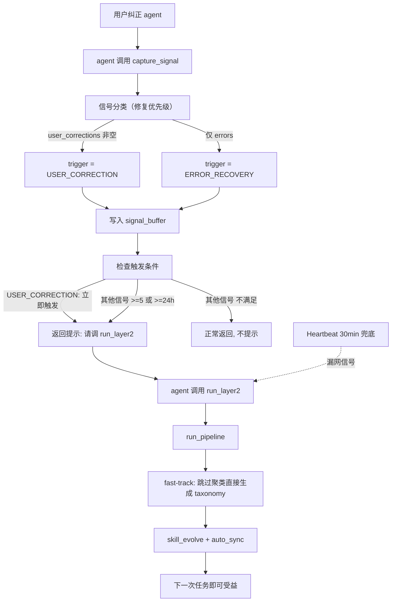

# Layer 2 自动触发机制设计（v2）

## 零、问题诊断：不只是"谁来调 run_layer2"

原始计划假设问题是**没人调 `run_layer2`**。但实际存在一个更根本的问题：

**即使 `run_layer2` 被调用了，`should_trigger()` 也会拒绝执行。**

当前 `should_trigger()` 的逻辑（[orchestrator.py](src/meta_learning/layer2/orchestrator.py) 第51-64行）：

```python
def should_trigger(self) -> bool:
    pending = list_pending_signals(self._config)
    if len(pending) >= 5:      # 默认 min_pending_signals=5
        return True
    last_run = self._load_last_run_time()
    if last_run is None:
        return len(pending) > 0  # 首次：有就跑
    hours_since = (datetime.now() - last_run).total_seconds() / 3600
    if hours_since >= 24:        # 默认 max_hours_since_last=24
        return len(pending) > 0
    return False
```

**实际场景推演**：
1. 用户纠正 agent 一次 -> `capture_signal` 写入 1 条 signal
2. 即使有人调 `run_layer2`(不带 force)，`should_trigger()` 返回 False（1 < 5，且可能不满足 24h）
3. 用户的纠正石沉大海，系统没有学到任何东西
4. 用户第二天遇到同类错误，agent 依然犯错

更讽刺的是：`run_pipeline` 内部已经实现了 `USER_CORRECTION` 的 fast-track 路径（跳过聚类直接生成 taxonomy），但这段代码被 `should_trigger()` 的门控挡住了——**fast-track 在实际使用中是死代码**。

还有一个信号分类的 bug：[signal_capture.py](src/meta_learning/layer1/signal_capture.py) 第27-35行是 first-match-wins，如果用户纠正的同时存在 errors_encountered，信号被分类为 `ERROR_RECOVERY` 而非 `USER_CORRECTION`，导致 fast-track 路径不会激活。

---

## 一、竞品调研：同类系统如何处理"第一次纠正"

### AutoSkill（ECNU, 2025.02, arxiv 2603.01145）

- **每次交互即提取 skill**，不做批处理
- 支持 interactive extraction（对话中实时提取）和 offline extraction（归档对话回溯提取）
- skill 立即可用，通过 merge/version 持续演进
- **关键设计**：学习粒度是单次交互，不是 N 次积累后批处理

### self-improving-agent（OpenClaw/ClawHub, 1100+ stars）

- 纠正发生时**立即写入** `.learnings/LEARNINGS.md`
- agent 在下一次任务开始前**读取 learnings**，立即应用
- **promotion 机制**：多次相关 learning 积累后，提升为永久规则（写入 AGENTS.md）
- **关键设计**：即时记录 + 即时应用，promotion（相当于 Layer 2 consolidation）是渐进的增强而非前置门控

### ExpeL（Tsinghua, AAAI 2024）

- 三阶段：收集经验池 -> 提取 insights（ADD/UPVOTE/DOWNVOTE/EDIT）-> 推理时应用
- insights 提取是离线的，但用 UPVOTE/DOWNVOTE 增量更新，不需要等到一定数量
- **关键设计**：每个新经验都可以 ADD 新 insight 或 UPVOTE 已有 insight，不需要 batch threshold

### Voyager / ViReSkill

- 成功时立即将 skill 存入 library
- ViReSkill：失败时立即 replan，成功后立即存储
- **关键设计**：单次成功/失败即触发知识沉淀

### 共同模式

**所有主流系统都对高价值信号（用户纠正/失败修复）做即时学习。** 批处理仅用于低频聚合（跨任务模式挖掘、cluster 合并等增强操作），不作为首次学习的前置条件。

---

## 二、现状分析：capture_signal 的提示注入

**当前状态：有提示，但措辞模糊且无强制机制。**

提示通过 `ContextBuilder.build_system_prompt()` 注入到每次 LLM 调用的 system prompt 中：

- [AGENTS.md](~/.deskclaw/nanobot/workspace/AGENTS.md) 第25行：`After completing a task where the user corrected your approach, call capture_signal.`
- [skills/meta-learning/SKILL.md](~/.deskclaw/nanobot/workspace/skills/meta-learning/SKILL.md) 第13行：`After the user corrects your approach, call capture_signal to record the lesson.`

两者通过 `ContextBuilder._load_bootstrap_files()` 和 `get_always_skills()` 分别注入。

**问题**：措辞模糊（什么算"纠正"未定义），无执行保障，完全依赖 LLM 遵从性，且没有任何关于 `run_layer2` 的指令。

---

## 三、修复方案：分层触发策略

核心思路：**对 user_correction 即时学习，对其他信号保留批处理模型**。



### 修改 1：信号分类优先级修复

**位置**：[src/meta_learning/layer1/signal_capture.py](src/meta_learning/layer1/signal_capture.py) `_determine_trigger()`

**当前问题**：errors + user_corrections 同时存在时 -> `ERROR_RECOVERY`（吞没纠正信号）

**修改**：`user_corrections` 非空时**优先**返回 `USER_CORRECTION`，因为用户纠正是最高价值信号：

```python
def _determine_trigger(self, context: TaskContext) -> TriggerReason | None:
    if context.user_corrections:
        return TriggerReason.USER_CORRECTION

    if context.errors_fixed and context.errors_encountered:
        return TriggerReason.ERROR_RECOVERY
    if context.errors_encountered:
        return TriggerReason.ERROR_RECOVERY
    # ... rest unchanged
```

**依据**：AutoSkill 和 self-improving-agent 都将用户纠正作为最高优先级信号源。meta-learning问题定义.md 中也指出这是当前系统的已知缺陷。

### 修改 2：`should_trigger()` 分层触发

**位置**：[src/meta_learning/layer2/orchestrator.py](src/meta_learning/layer2/orchestrator.py) `should_trigger()`

**修改**：USER_CORRECTION 信号存在即触发，其他信号阈值从 >=5/24h 调整为 >=2/8h：

```python
def should_trigger(self) -> bool:
    pending = list_pending_signals(self._config)
    if not pending:
        return False

    if any(s.trigger_reason == TriggerReason.USER_CORRECTION for s in pending):
        return True

    if len(pending) >= self._config.layer2.trigger.min_pending_signals:  # 改为 2
        return True

    last_run = self._load_last_run_time()
    if last_run is None:
        return True
    hours_since = (datetime.now() - last_run).total_seconds() / 3600
    if hours_since >= self._config.layer2.trigger.max_hours_since_last:  # 改为 8
        return True
    return False
```

同时修改 [config.yaml](config.yaml) 中的默认值：
```yaml
layer2:
  trigger:
    min_pending_signals: 2    # 原 5
    max_hours_since_last: 8   # 原 24
```

**效果**：
- USER_CORRECTION：即时触发（1 条即可）
- 其他信号：>=2 条即触发，或 >=8h 有 pending 即触发
- 大幅缩短从信号到学习的延迟

### 修改 3：`capture_signal` 返回值附加触发提示

**位置**：[src/meta_learning/mcp_server.py](src/meta_learning/mcp_server.py) `capture_signal()` 函数末尾

**修改**：signal 写入成功后，检查 `should_trigger()`，满足条件则在返回消息中附加明确行动指令：

```python
signal = capture.evaluate_and_capture(context)
if signal is None:
    return "no signal captured ..."

result = f"Signal captured: [{signal.signal_id}] trigger={signal.trigger_reason.value} ..."

# 检查是否应触发 Layer 2
from meta_learning.layer2.orchestrator import Layer2Orchestrator
orchestrator = Layer2Orchestrator(config, _create_llm(config))
pending = list_pending_signals(config)
if orchestrator.should_trigger():
    result += (
        f"\n\n[Action Required] Layer 2 trigger conditions met "
        f"({len(pending)} pending signal(s)). "
        f"Call `run_layer2` now to consolidate learnings into skills."
    )

return result
```

**依据**：agent 看到 tool result 中的明确 action 指令，遵从率远高于仅靠 system prompt 中的静态规则。这是事件驱动的——只在条件满足时提示，不会造成噪音。

### 修改 4：提示增强 — AGENTS.md 和 SKILL.md

**位置**：`~/.deskclaw/nanobot/workspace/AGENTS.md` 和 `skills/meta-learning/SKILL.md`

**AGENTS.md 修改**：

```markdown
## Meta-Learning

After completing a task where the user corrected your approach, call `capture_signal`
with the `user_corrections` field populated.
Before risky operations, call `quick_think` to check for known pitfalls.
After calling `capture_signal`, if the response includes "[Action Required]",
immediately call `run_layer2` to consolidate learnings.
When a learning cycle completes, call `sync_taxonomy_to_nobot` to keep skill files up to date.
```

**SKILL.md 修改**：增加 `run_layer2` 的调用时机说明。

### 修改 5：Heartbeat 定时兜底

**位置**：`~/.deskclaw/nanobot/workspace/HEARTBEAT.md`

在 Active Tasks 中添加：

```markdown
- Check if meta-learning Layer 2 needs to run: call `run_layer2` (without force).
  If it says conditions not met, do nothing. If it runs, report the result.
```

Heartbeat 每 30 分钟触发一次（[service.py](~/.deskclaw/gateway-venv/lib/python3.12/site-packages/nanobot/heartbeat/service.py) 第131行），作为安全网兜住 agent 未响应提示的情况。

---

## 四、修改位置与注入路径总结

- **修改 1** — `signal_capture.py` `_determine_trigger()`：修复信号分类优先级，确保 user_corrections 不被吞没
- **修改 2** — `orchestrator.py` `should_trigger()`：USER_CORRECTION 信号存在即触发，激活 fast-track 死代码
- **修改 3** — `mcp_server.py` `capture_signal()`：返回值中附加行动指令，通过 MCP tool result 注入 agent 上下文
- **修改 4** — `AGENTS.md` + `SKILL.md`：通过 `ContextBuilder.build_system_prompt()` 注入 system prompt
- **修改 5** — `HEARTBEAT.md`：通过 `HeartbeatService._tick()` -> `on_execute` 定时注入 agent loop

修改 1-3 是代码变更（在 lingmin-meta-learning 项目内），修改 4-5 是配置文件编辑（nanobot workspace）。

---

## 五、场景验证

**场景 A：用户首次纠正**
1. 用户纠正 agent -> agent 调 `capture_signal(user_corrections=["不要直接 rm，先检查文件"])`
2. `_determine_trigger` -> `USER_CORRECTION`（修改 1 确保不被 errors 吞没）
3. signal 写入 `signal_buffer/`
4. `capture_signal` 检查 `should_trigger()` -> True（修改 2：有 USER_CORRECTION 即触发）
5. 返回 `"Signal captured ... [Action Required] Call run_layer2 now"`
6. agent 看到提示，调 `run_layer2()`
7. `run_pipeline` -> materialize -> fast-track（跳过聚类）-> taxonomy -> skill_evolve -> auto_sync
8. 新规则写入 SKILL.md，下次任务即可受益

**场景 B：低频 error_recovery 信号积累**
1. agent 自行修复错误，无用户纠正 -> `ERROR_RECOVERY` signal（1 条）
2. `should_trigger()` -> False（1 < 2，且未满 8h）
3. `capture_signal` 返回普通消息，不提示
4. 第 2 条 error_recovery 信号到来时 -> `should_trigger()` -> True（>=2），提示调 `run_layer2`
5. 或 8h 后 Heartbeat 兜底触发

**场景 C：agent 忘记调 run_layer2**
1. `capture_signal` 返回了 `[Action Required]`，但 agent 由于上下文过长忽略了
2. 30 分钟后 Heartbeat 唤醒 agent
3. HEARTBEAT.md 中有 "check if Layer 2 needs to run" 任务
4. agent 调 `run_layer2()` -> 补偿执行
