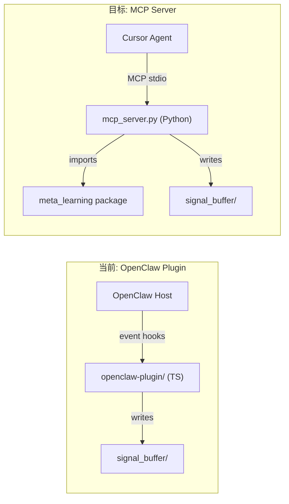

# MCP Server 替代 OpenClaw 插件

## 背景

当前 `openclaw-plugin/` 是一个 TypeScript 插件，通过 OpenClaw 的事件钩子 (`before_prompt_build`, `agent_end`, `before_tool_call`) 实现 Layer 1 功能。现在要将其替换为标准 MCP Server，使其可以被 Cursor 等任何支持 MCP 协议的 AI 客户端调用。

## 架构变化




**核心优势：** Python MCP Server 直接 import 已有的 `meta_learning` 包，无需维护两套实现。Python 版 Layer 1 比 TS 插件更完整（支持 `new_tool`、`recent_failure_pattern` 两个额外信号）。

## 关键设计决策

### 1. 模块位置：包内模块 vs 独立目录

**选择：放在 `src/meta_learning/mcp_server.py`**（包内模块）

原计划的 `mcp-server/server.py` 有两个问题：

- 目录名 `mcp-server` 含连字符，不能作为 Python 包名
- `.cursor/mcp.json` 中 `args: ["-m", "mcp_server.server"]` 需要 `mcp_server` 在 Python path 上，但它不是已安装的包

放在包内后，运行命令变为 `python -m meta_learning.mcp_server`，只要项目通过 `pip install -e .` 安装（venv 中已经是这样），import 路径天然可用。

### 2. capture_signal 的接口：结构化字段 vs 原始消息

**选择：结构化字段**

原 TS 插件的 `analyzeMessagesForSignal` 接收原始消息数组并用正则提取信息。但在 MCP 场景下：

- Agent（LLM）本身就理解对话上下文，比正则匹配更准确
- 传递完整消息历史作为 tool 参数开销过大
- Agent 可以直接告诉 tool「发生了什么错误」「用户纠正了什么」

因此 `capture_signal` 接受 `TaskContext` 级别的结构化字段：

```python
@mcp.tool()
def capture_signal(
    task_description: str,
    session_id: str = "unknown",
    errors_encountered: list[str] = [],
    errors_fixed: bool = False,
    user_corrections: list[str] = [],
    tools_used: list[str] = [],
    new_tools: list[str] = [],
    step_count: int = 0,
) -> str: ...
```

这直接映射到已有的 `TaskContext` model（`[src/meta_learning/shared/models.py](src/meta_learning/shared/models.py)` L183-192），无需额外适配层。

### 3. 从被动钩子到主动调用：行为差异的弥补

原 OpenClaw 插件的 `before_prompt_build` 是**自动触发**的 — agent 无需主动调用。MCP 工具需要 agent **显式调用**。

弥补方案：添加 `.cursor/rules/meta-learning.mdc` Cursor 规则文件，指导 agent 在执行任务前自动调用 `quick_think`，任务结束后调用 `capture_signal`。

### 4. 依赖管理：避免硬绑定

`mcp` 包不应成为 `meta_learning` 的硬依赖（纯做 Layer 2/3 CLI 的用户不需要它）。

**选择：optional dependency**

在根 `[pyproject.toml](pyproject.toml)` 中：

```toml
[project.optional-dependencies]
mcp = ["mcp>=1.20"]
```

安装：`pip install -e ".[mcp]"`

### 5. QuickThinkIndex 生命周期

`QuickThinkIndex` 是有状态的（维护 known_tools、recent_failure_signatures）。MCP stdio server 是长驻进程，适合做单例：

- Server 启动时 lazy-load（首次调用 `quick_think` 时初始化）
- Taxonomy 从文件加载，每次调用时检查文件 mtime 判断是否需要 reload
- `capture_signal` 中如果检测到 error_recovery，自动注册 failure signature 到 QuickThinkIndex

### 6. Layer 2/3 的 LLM 创建

`run_layer2` / `run_layer3` 需要 `LLMInterface`。复用 `[__main__.py](src/meta_learning/__main__.py)` 的 `create_llm()` 逻辑：

- 读 config 中的 `llm.provider`
- 如果是 `"openai"`，需要 `OPENAI_API_KEY` 环境变量（通过 `.cursor/mcp.json` 的 `env` 传入）
- 如果是 `"stub"`（默认），使用 StubLLM

## MCP Server API 设计

### Tools

- `**quick_think(user_message: str, tools_used: list[str] = [])**` — 风险评估。调用 `QuickThinkIndex.evaluate()`，返回 `formatRiskWarning` 结果或 "no risk detected"
- `**capture_signal(task_description, session_id, errors_encountered, errors_fixed, user_corrections, tools_used, new_tools, step_count)**` — 构造 `TaskContext`，调用 `SignalCapture.evaluate_and_capture()`，返回信号 ID 和路径
- `**run_layer2(force: bool = False)**` — 异步运行 `Layer2Orchestrator.run_pipeline()`
- `**run_layer3()**` — 异步运行 `Layer3Orchestrator.run_pipeline()`
- `**status()**` — 返回待处理信号数、经验总数、分类树条目数

### Resources

- `**meta-learning://taxonomy**` — 当前 `error_taxonomy.yaml` 的 YAML 内容
- `**meta-learning://config**` — 当前生效的配置（JSON dump）

### Prompts

- `**risk-assessment**` — 生成包含 quick_think 使用指导的提示模板，帮助 agent 在任务前评估风险

## 文件变更清单

**新增：**

- `[src/meta_learning/mcp_server.py](src/meta_learning/mcp_server.py)` — MCP Server 主文件（约 200 行）
- `[.cursor/mcp.json](.cursor/mcp.json)` — Cursor MCP 注册配置
- `[.cursor/rules/meta-learning.mdc](.cursor/rules/meta-learning.mdc)` — Agent 行为规则（何时调用 quick_think / capture_signal）
- `[tests/test_mcp_server.py](tests/test_mcp_server.py)` — MCP tool handler 单元测试

**修改：**

- `[pyproject.toml](pyproject.toml)` — 添加 `[project.optional-dependencies] mcp = ["mcp>=1.20"]`
- `[.gitignore](.gitignore)` — 添加 `.cursor/` 相关忽略项（保留 `mcp.json` 和 `rules/`）

**不动：**

- `openclaw-plugin/` — 保留在仓库中，本 PR 不删除（后续可单独清理）

## `.cursor/mcp.json`

```json
{
  "mcpServers": {
    "meta-learning": {
      "command": "${workspaceFolder}/venv/bin/python3",
      "args": ["-m", "meta_learning.mcp_server"],
      "env": {
        "META_LEARNING_WORKSPACE": "${workspaceFolder}",
        "META_LEARNING_CONFIG": "${workspaceFolder}/config.yaml"
      }
    }
  }
}
```

## 分支策略

从 `main` 签出新分支 `feat/mcp-server`。