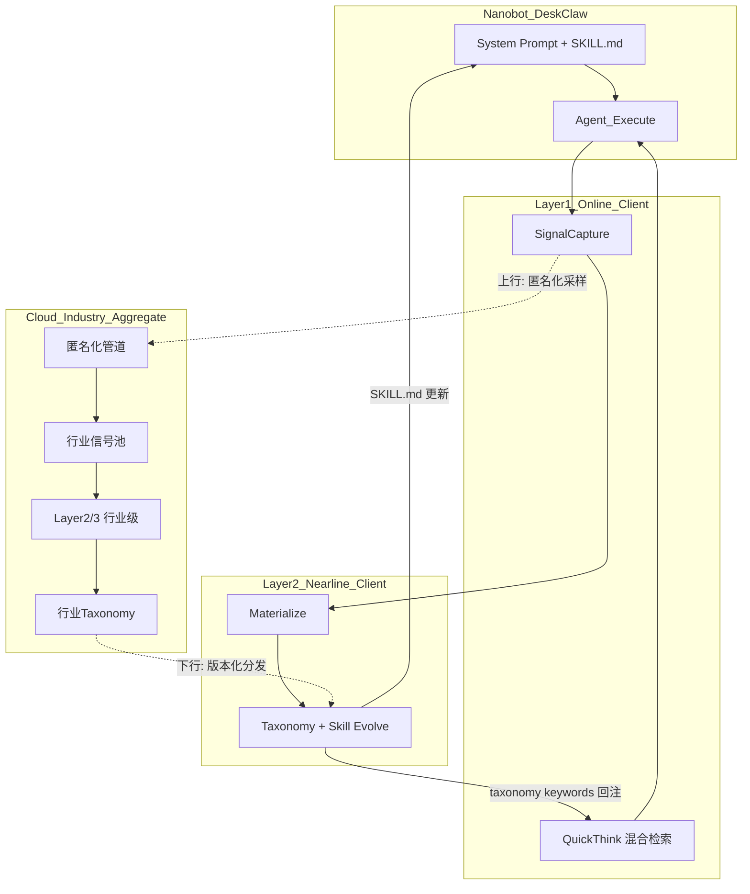

# Meta-Learning 问题定义与同类工作研究报告 — 执行计划

## 一、背景与核心约束

- **权威架构图**：[`meta_learning_chain_fusion.drawio`](meta_learning_chain_fusion.drawio)（Nobot x Meta-Learning 融合架构），包含 Nanobot/DeskClaw 对话生态、MCP 桥接、Layer 1-3 全链路与反馈回路。
- **参照模板**：[`claw失忆/问题定义.md`](claw失忆/问题定义.md)，采用「现象 -> 根因（分条、映射架构/配置）-> 影响」三段结构。
- **本仓库定位**（[README.md](README.md)）：三层策略与流程学习系统（非记忆系统），策略层可学 / 参数层不可学，信号仅来自 agent 可观测数据。
- **关键对照**：claw 失忆文档解决「**记不住**」（记忆存储/检索/注入），meta-learning 解决「**学不会**」（从错误中提炼可迁移策略并前置拦截），二者互补但问题域不同。
- **对话记录**（agent transcript `e5642a1b`）：已产出 6 篇论文对比 + P0-P2 缺陷分析 + 多用户行业沉淀场景再评估。

## 二、交付物

- **问题定义文档**：`meta-learning问题定义.md`（项目根目录，与 `claw失忆/` 并列）
  - 仅包含问题陈述，不写变更日志
  - 三段式，对标 claw 文档结构
- **研究报告**：`meta-learning同类工作与创新点研究报告.md`（同目录）
  - 含文献矩阵、对比分析、诚实的创新/非创新结论
  - 含多用户/行业沉淀场景下的应然架构 vs 实然代码分析

## 三、问题定义文档 — 大纲

### 一、问题现象：Agent「学不会」的困境

从用户/任务层面写「痛」，与失忆文档**对照但不重叠**：

- **策略错误反复犯**：同类任务（如"先验证再执行"）失败后，Agent 下次遇到仍犯同样的策略错误
- **失败后知识不成体系**：纠正被记录为散乱的记忆片段，未形成「遇到 X 场景 -> 应该采取 Y 策略」的可执行规程
- **仅事后 RAG/记忆搜索无法形成可执行规程**：即使检索到历史失败记录，Agent 缺乏将其转化为行动指导的机制
- **风险操作无前置拦截**：不可逆操作、已知失败模式没有在执行前被预警
- **纠正信号稀薄或延迟**：仅有粗粒度 reward（成功/失败），缺乏策略级诊断依据
- **多用户/多场景经验无法复用与治理**：A 用户踩过的坑，B 用户依然会踩；行业经验无法沉淀

**对照小节**（简短）：「记不住」（claw 失忆）vs「学不会」（meta-learning），前者是存储/检索/注入链路缺陷，后者是经验提炼/结构化/前置应用链路缺陷。

### 二、根本原因（映射到架构与代码）

每条根因需引用 [`meta_learning_chain_fusion.drawio`](meta_learning_chain_fusion.drawio) 中对应模块与 [`src/meta_learning/`](src/meta_learning/) 代码。

- **(一) 信号与诊断粒度不足**
  - 仅有 reward=0/1 时 LLM 无法提取策略级教训（引用 [`c-b-a 计划`](.cursor/plans/c-b-a_架构-任务-诊断修复_30290041.plan.md) 的实验结论）
  - `TaskContext` 对 conversation/tool_calls/user_corrections 的依赖及 session 文件截断风险
  - 信号捕获仅 4 种触发条件（[`signal_capture.py`](src/meta_learning/layer1/signal_capture.py)），覆盖面有限

- **(二) 学习时效与冷启动**
  - Layer2 触发阈值（默认 5 条 pending 或 24h）导致前几天几乎无学习能力
  - 无预置种子 taxonomy，新用户从零开始

- **(三) 知识结构化 vs 复杂度的未证命题**
  - `ErrorTaxonomy`（domain -> subdomain -> entry）三级层级 + QuickThink 混合检索（关键词优先 + 向量回退）
  - 相比 flat skill list + embedding 检索（如 AutoSkill），复杂度更高但效果未经 A/B 验证

- **(四) 闭环与度量缺失**
  - 无 QuickThink 命中率、采纳率、命中后任务成功率等指标
  - Layer 3 输出（跨任务挖掘/盲区/记忆建议）不回流到 Layer 1/2，是「开环」

- **(五) 多用户愿景与单机实现的鸿沟**（若纳入 nanobot + MCP + 行业沉淀场景）
  - `Signal` 无 `user_id`，`TaxonomyEntry` 无 `source_scope`（personal/team/industry）
  - 无信号上行（客户端 -> 云端）/ taxonomy 下行（云端 -> 客户端）通道
  - 无隐私/匿名化/consent 机制
  - 无信号可信度跨用户验证（单用户纠正 != ground truth）
  - 无 personal vs industry taxonomy 合并与冲突策略
  - 全量数据存本地文件系统（YAML），无并发/事务支持

### 三、影响分析

1. 用户重复试错：同类策略错误不收敛，任务完成效率低
2. 组织知识资产为零：每个 Agent 实例独立摸索，行业经验不积累
3. 风险不可控：已知高风险模式无前置拦截，只能事后复盘
4. 度量不可报告：无法向管理层/客户证明「学习系统确实提升了 Agent 表现」
5. 多用户场景需大量补建基础设施：当前架构从本地原型到产品化的工程量被低估

## 四、研究报告 — 章节结构

### 第一章：研究背景与方法

- 检索范围：arXiv 2025.06 - 2026.03、MCP 官方生态、工业产品（Cursor/Copilot）
- 检索日期：2026-03-31 当周
- 方法：论文 abstract + method + experiments 精读 + 开源 repo 代码验证

### 第二章：文献矩阵

固定维度的对比列表，**至少覆盖**以下工作（arXiv 编号以执行阶段核实的最新版为准）：

- **AutoSkill**（2603.01145）：经验驱动技能自演进，模型无关插件层，动态注入
- **MemEvolve**（2512.18746）：记忆系统元进化，encode/store/retrieve/manage 全部可变异
- **MemSkill**（2602.02474）：记忆算子技能化，controller + executor + designer 闭环
- **MetaAgent**（2508.00271）：工具元学习 + self-reflection，自主构建工具库
- **AutoAgent**（2603.09716）：Evolving Cognition + Elastic Memory
- **HyperAgents / Darwin Godel Machine**（Meta, 2026.03）：元过程自修改
- **MetaClaw**（2603.17187）：持续元学习 + 空闲 LoRA 微调
- **工业侧**：Cursor/Copilot 隐式遥测 + RLHF
- **协议侧**：MCP Skills 2.0 / experimental-ext-skills Interest Group

每个工作记录：核心问题、机制、是否改模型参数、实验证据、与本项目的关系。

### 第三章：本项目创新点分析（诚实评估）

**写作原则**：区分「科学问题新异性」（通常不新）与「产品/工程差异」（可能有壁垒）。每条创新配套反驳。

可辩护的差异点：
- **online/nearline/offline 三层解耦 + signal -> experience -> taxonomy -> skill 五级沉淀**（对比 AutoSkill flat 结构）
  - 解决的子问题：行业场景需要按域聚合，flat 不够
  - 反驳：复杂度换结构化未经验证优于 flat + embedding
- **QuickThink 事前拦截**（对比多数框架仅事后注入）
  - 解决的子问题：不可逆操作和已知失败模式的预防
  - 反驳：当前实现本质是规则引擎 + 关键词/向量匹配，非「学习」
- **显式、可审查的知识库**（对比 Cursor/Copilot 隐式学习）
  - 解决的子问题：合规/审计场景需要知道 Agent 学了什么
  - 反驳：显式 != 更好的效果
- **多用户行业沉淀潜力**（对比所有学术工作均为单用户）
  - 解决的子问题：network effect，用户量 x 信号密度 x taxonomy 质量
  - 反驳：当前零实现，数据模型/通道/隐私全部缺失

### 第四章：多用户/行业沉淀 — 应然架构 vs 实然代码

- **应然**数据流（含 mermaid 图）：客户端 signal -> 匿名化 -> 云端信号池 -> 行业 taxonomy -> 版本化下发 -> 客户端 merge
- **实然**代码现状：全本地文件系统、无 user_id、无网络层
- 差距清单（对齐 e5642a1b 对话中的 P0-P2 分析）
- 对齐 MCP Skills 标准的建议

### 第五章：结论与下一步

- 明确回答「是否有创新」
- 创新的条件与边界（需验证什么、需补建什么）
- 引用 [`gdpval_meta-learning_validation 计划`](.cursor/plans/gdpval_meta-learning_validation_cb51c142.plan.md) 作为已有验证线索

## 五、数据流参考图（报告第四章用）

## 六、执行顺序

1. **文献检索**（todo: literature-search）：批量联网检索上表论文的 abstract + method + experiments
2. **文献矩阵**（todo: literature-matrix）：整理为结构化对比
3. **代码精读**：确认 [`shared/models.py`](src/meta_learning/shared/models.py)、[`layer1/quick_think.py`](src/meta_learning/layer1/quick_think.py)、[`layer2/orchestrator.py`](src/meta_learning/layer2/orchestrator.py)、[`layer3/orchestrator.py`](src/meta_learning/layer3/orchestrator.py) 的实际行为与文档描述一致
4. **撰写问题定义**（todo: problem-def-md）：严格三段式
5. **提炼对话论点**（todo: transcript-synthesis）：从 e5642a1b 提取 6 个竞品创新点 + 本方案评价
6. **撰写研究报告**（todo: research-report-md）：五章结构
7. **交叉检查**（todo: consistency-review）：每条创新主张有子问题映射 + 验证线索，无与代码矛盾的宣传

## 七、风险与范围

- **论文版本**：预印本以执行日 arXiv 为准，报告注明检索日期
- **客观性**：对乐观叙述保持对称反驳（用户已要求理性评价）
- **不产出**：不自动生成 CHANGELOG / 变更日志类文件
- **README 已更新**：架构图引用已修正为 `meta_learning_chain_fusion.drawio`，QuickThink 向量回退已补充说明
