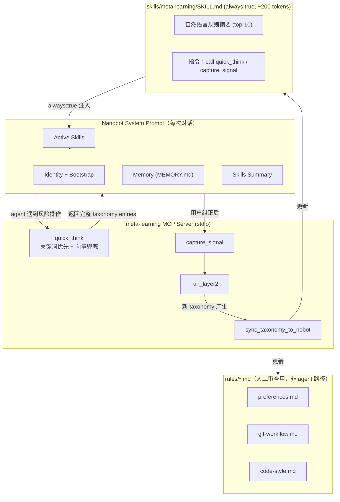
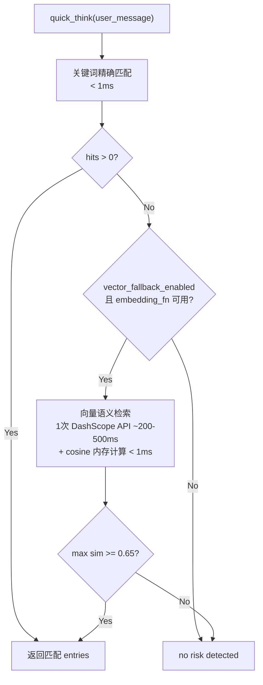

---
todos:
  - id: hybrid-retrieval
    content: "升级 QuickThinkIndex：新增 embedding_fn、_precompute_embeddings、_check_vector_match；evaluate 流程改为 keyword-first vector-fallback"
    status: completed
  - id: qt-config
    content: "QuickThinkConfig 新增 vector_fallback_enabled / vector_similarity_threshold / vector_top_k"
    status: completed
  - id: mcp-embedding-init
    content: "mcp_server.py 的 _get_quick_think_index() 初始化 embedding_fn"
    status: completed
  - id: sync-module
    content: "创建 sync_nobot.py：taxonomy → 自然语言 SKILL.md + rules/*.md（人工审查用）"
    status: completed
  - id: sync-tool
    content: "mcp_server.py 新增 sync_taxonomy_to_nobot tool"
    status: completed
  - id: auto-sync
    content: "Layer 2 orchestrator run_pipeline() 末尾自动 sync"
    status: completed
  - id: config-nobot
    content: "配置 nanobot：config.json + skill 目录 + AGENTS.md + python 路径修复 + LLM API 环境变量"
    status: completed
  - id: data-dir
    content: "创建 meta-learning-data 目录 + 默认 config.yaml"
    status: completed
  - id: e2e-verify
    content: "端到端验证：纠正 → signal → Layer2 → sync → SKILL.md 更新 + quick_think 跨语言命中 + nanobot 真实对话遵从规则"
    status: completed
---

# Nobot Meta-Learning 集成（Final）

## 一、架构总览



## 二、核心设计决策

### 2.1 SKILL.md：纯自然语言，无 ID 编号

**否决**：`[CS-001] Use 4-space indentation` 这种 ID 编号格式。

**原因**：Agent 无法从简略 ID 推导文件路径，且 agent 不需要 `read_file` 详情——`quick_think` 已能返回完整信息。

**采用**：纯自然语言摘要 + tool call 指令，示例：

```markdown
---
name: meta-learning
description: Learned rules from past mistakes and user corrections.
always: true
---
# Meta-Learning Rules

You have learned the following rules from past interactions:
- Projects go in ~/projects (not ~/workspace)
- Always create feature branch before changes
- Use 4-space indentation, no semicolons in JS/TS

Before risky or repetitive actions, call `quick_think` to get detailed guidance.
After the user corrects your approach, call `capture_signal` to record the lesson.
```

**约束**：最多 10 条规则摘要，按 confidence 降序取 top-10，~200-300 tokens。

### 2.2 rules/*.md：仅供人工审查

`skills/meta-learning/rules/` 下按类别生成的详情文件（preferences.md, git-workflow.md 等）**仅用于用户/开发者审查和调试**，不是 agent 的检索路径。Agent 获取详细规则的唯一路径是 `quick_think` MCP tool。

### 2.3 quick_think：Keyword-first, Vector-fallback

**当前问题**（[quick_think.py](src/meta_learning/layer1/quick_think.py) L61-74）：纯精确子串匹配，跨语言/同义改写/抽象表述无法命中。

**混合检索设计**：



**速度保证**：
- 关键词命中（大多数情况）：MCP 协议开销 + < 1ms = ~100-200ms
- 向量兜底（keyword miss 时）：MCP 开销 + ~200-500ms = ~400-700ms
- 对比：一次 LLM 推理 = 2,000-10,000ms
- 结论：即使向量兜底，额外延迟占比 < 5-10%，可忽略

**Pre-computed embeddings**：taxonomy 加载/更新时一次性为所有 entries 计算 embedding 缓存到内存。Per-query 只需 1 次 DashScope 调用（query embedding）。

**Graceful degradation**：DashScope 不可用时自动降级为纯关键词，不 break。

---

## 三、实现步骤

### 3.1 升级 QuickThinkIndex — 混合检索

修改 [src/meta_learning/layer1/quick_think.py](src/meta_learning/layer1/quick_think.py)：

- `__init__` 新增可选 `embedding_fn` 参数
- 新增 `_precompute_embeddings()`：为每个 entry 生成 embedding 文本 = `f"{name} {trigger} {prevention} {' '.join(keywords)}"`，调用 embedding_fn，缓存到 `_taxonomy_embeddings: dict[str, list[float]]`
- 新增 `_check_vector_match(context) -> list[TaxonomyEntry]`：计算 query embedding，cosine similarity 对比预计算向量，返回 top-K above threshold
- 修改 `evaluate()`：keyword miss 时 fallback 到 vector match
- `update_taxonomy()` 中重新计算 embeddings

### 3.2 QuickThinkConfig 扩展

修改 [src/meta_learning/shared/models.py](src/meta_learning/shared/models.py) 的 `QuickThinkConfig`：

```python
class QuickThinkConfig(BaseModel):
    # existing fields...
    vector_fallback_enabled: bool = True
    vector_similarity_threshold: float = 0.65
    vector_top_k: int = 3
```

### 3.3 MCP Server 初始化 embedding

修改 [src/meta_learning/mcp_server.py](src/meta_learning/mcp_server.py) 的 `_get_quick_think_index()`：
- 当 `config.dashscope.enabled` 且 `config.layer1.quick_think.vector_fallback_enabled` 时，创建 `MultimodalEmbedding` 实例
- 将 `embedding.embed_text_only` 作为 `embedding_fn` 传入 `QuickThinkIndex`
- 复用已有的 [embedding_dashscope.py](src/meta_learning/shared/embedding_dashscope.py) `MultimodalEmbedding` 类

### 3.4 创建 sync_nobot 模块

新建 `src/meta_learning/sync_nobot.py`，核心函数：

```python
def sync_taxonomy_to_nobot_workspace(
    config: MetaLearningConfig,
    nobot_skills_path: str,
    max_always_rules: int = 10,
) -> SyncResult:
```

功能：
1. 读取 error_taxonomy.yaml 全部 entries
2. 按 confidence 降序取 top-N → 生成自然语言摘要写入 `{nobot_skills_path}/meta-learning/SKILL.md`
3. 按 keywords 分类 → 生成 `{nobot_skills_path}/meta-learning/rules/{category}.md`（人工审查用）

分类策略（基于 keywords 集合交集）：
- path/directory/folder/workspace → `preferences.md`
- git/branch/commit/push → `git-workflow.md`
- style/indent/format/naming → `code-style.md`
- verify/check/test/backup → `verification.md`
- 其他 → `general.md`

### 3.5 MCP tool + 自动触发

- `mcp_server.py` 新增 `sync_taxonomy_to_nobot` tool（可选 `nobot_workspace` 参数）
- [layer2/orchestrator.py](src/meta_learning/layer2/orchestrator.py) 的 `run_pipeline()` 末尾：`if result.new_taxonomy_entries > 0` 则调用 sync

### 3.6 Nobot 配置

**config.json**（`~/.deskclaw/nanobot/config.json`）注册 MCP server：
```json
"meta-learning": {
  "type": "stdio",
  "command": "python",
  "args": ["-m", "meta_learning.mcp_server"],
  "env": {
    "META_LEARNING_WORKSPACE": "~/.deskclaw/nanobot/workspace/meta-learning-data"
  }
}
```

**AGENTS.md**（`~/.deskclaw/nanobot/workspace/AGENTS.md`）追加：
```markdown
## Meta-Learning
After completing a task where the user corrected your approach, call `capture_signal`.
Before risky operations, call `quick_think` to check for known pitfalls.
```

**skill 初始模板**：`~/.deskclaw/nanobot/workspace/skills/meta-learning/SKILL.md`（空壳，sync 后自动填充）

**data 目录**：`~/.deskclaw/nanobot/workspace/meta-learning-data/`（signal_buffer, experience_pool, error_taxonomy.yaml, config.yaml）

---

## 四、文件变更清单

**新增**：
- `src/meta_learning/sync_nobot.py`
- `~/.deskclaw/nanobot/workspace/skills/meta-learning/SKILL.md`
- `~/.deskclaw/nanobot/workspace/meta-learning-data/config.yaml`

**修改**：
- `src/meta_learning/layer1/quick_think.py`：混合检索
- `src/meta_learning/shared/models.py`：QuickThinkConfig 增加 3 个 vector 配置项
- `src/meta_learning/mcp_server.py`：embedding 初始化 + sync tool
- `src/meta_learning/layer2/orchestrator.py`：自动 sync
- `~/.deskclaw/nanobot/config.json`：注册 MCP server
- `~/.deskclaw/nanobot/workspace/AGENTS.md`：+3 行
