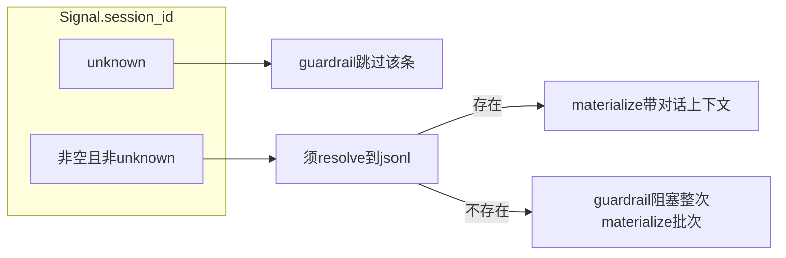

---
todos:
  - id: review-commit
    content: 审查 git diff，按语义拆分或单提交，中文 commit message；含未跟踪的 sync_nobot.py
    status: pending
  - id: pytest-full
    content: ".venv/bin/python -m pytest 全量；提交前再跑一遍"
    status: pending
  - id: nobot-mcp-smoke
    content: "nobot/Cursor 侧配置 MCP（stdio），清单验证 quick_think / capture_signal / run_layer2 / sync"
    status: pending
  - id: session-path-e2e
    content: （可选）对齐 sessions_root 与 nobot 会话目录后，用真实 session_id 验 materialize
    status: pending
---

# 修复 session 测试后：行动项（精炼版）

## 1. 本计划在解决什么问题

| 维度 | 说明 |
|------|------|
| 自动化测试 | [`tests/test_orchestrator.py`](tests/test_orchestrator.py)、[`tests/test_materialize.py`](tests/test_materialize.py) 通过 mock `.jsonl` 满足 [`materialize.py`](src/meta_learning/layer2/materialize.py) 的 session guardrail，覆盖「非 unknown 的 session_id」路径。 |
| 与历史 e2e 的差异 | 若手动/脚本 e2e 使用 `session_id='unknown'`，guardrail **不检查**该条，materialize **无**真实对话 JSONL 上下文；与生产「signal 带来真实 session_id」不等价。 |
| 本计划不做的 | 不改业务逻辑；不写「变更日志」类文档（除非你另要求）；不强求一次弄清 nobot 会话目录即可完成 MCP smoke。 |

## 2. 当前工作区快照（执行前核对，可能随时间变化）

- 分支示例：`feat/nobot-meta-learning-fusioin`（以 `git branch` 为准）。
- 已修改：`quick_think.py`、`orchestrator.py`、`mcp_server.py`、`models.py`、`test_materialize.py`、`test_orchestrator.py`。
- 未跟踪：[`src/meta_learning/sync_nobot.py`](src/meta_learning/sync_nobot.py)（提交时勿漏）。
- 仓库内**无** `.github/workflows`；CI 以你实际使用的远端为准。
- README 提到示例 MCP 配置路径 `.cursor/mcp.json`；若本地无该文件，以你实际 Cursor/nobot MCP 配置为准。

## 3. 建议顺序与验收标准

### 3.1 审查并提交

1. `git status` 确认包含 `sync_nobot.py`。
2. `git diff` 通读：若全部为「nobot 集成 + session 测试修复」一条故事线 → **单提交**即可；若夹杂无关实验 → **拆提交**（例如：实现一提交、测试一提交），便于 `git bisect`。
3. Commit message：**中文**，一句话主题 + 必要时正文列要点。

**完成标准**：工作区干净，且提交范围与意图一致。

### 3.2 本地全量 pytest

```bash
cd /Users/yumeng/Documents/Projects/lingmin-meta-learning
.venv/bin/python -m pytest
```

**完成标准**：全绿、无 skip 异常激增（与基线一致）。

### 3.3 nobot / Cursor MCP smoke（不必先对齐 session 目录）

目标：证明进程可启动、工具可被宿主调用，与 [nobot 集成架构](nobot_meta-learning_集成_final_e164a326.plan.md) 一致。

**建议最小清单**（按你环境可调）：

1. 使用 `pip install -e ".[dev,mcp]"`（或项目当前推荐方式）保证 MCP 依赖可用。
2. 宿主侧配置 stdio 启动：`python -m meta_learning.mcp_server`（环境变量 / `config.yaml` 指向你的 `meta-learning-data` 或等价目录，见 README「路径」一节）。
3. 依次或抽样调用：`quick_think`、`capture_signal`（可用 `session_id='unknown'` 先打通）、`run_layer2`、`sync_taxonomy_to_nobot`（若已暴露）。
4. 观察：无启动即崩溃；工具返回结构化错误优于静默失败。

**完成标准**：上述路径在你本机 nobot/Cursor 下可重复执行。

### 3.4（可选）真实 session_id 与 nobot 会话目录对齐

仅在要验收「materialize 读到真实对话片段、guardrail 在生产布局下通过」时必做。

解析逻辑见 [`resolve_session_file`](src/meta_learning/shared/io.py)：在 `config.sessions_full_path`（由 `sessions_root` 展开）与 `{workspace_root}/sessions` 下查找 `{session_id}.jsonl`（及 `:` → `_` 变体）。

**操作要点**：

1. 在 nobot 运行时找到实际写入的会话 `.jsonl` 路径与 `session_id` 命名规则。
2. 将 `MetaLearningConfig` 的 `sessions_root` 和/或 `workspace_root` 设为能覆盖该目录的配置（与 MCP 启动环境一致）。
3. 用真实 `session_id` 写一条 signal 并跑 `run_layer2`，确认不再触发 `Unresolved session context`，且日志/产物体现使用了会话上下文（而非仅 `Session ... not found` 降级串）。

**完成标准**：同一条 signal 在「unknown」与「真实 session」两种配置下行为差异符合预期，且真实路径稳定可复现。

## 4. `unknown` vs 真实 `session_id`（决策速查）



## 5. 与原「修复后的下一步」草稿相比的增补

- 显式列出**未跟踪** `sync_nobot.py` 与当前分支/文件列表，避免提交遗漏。
- 为每步增加**完成标准**与可选 shell 命令。
- 将 session 解析与配置键（`sessions_root`、`workspace_root`）与代码引用对齐。
- MCP：不依赖仓库内一定存在 `.cursor/mcp.json`，与 README 表述兼容。

## 6. 可选后续（仍非必须）

- 在 README 加一句「e2e 使用 unknown 与真实 session 的差异」：仅当你希望降低后人误读成本时再做。
- GitHub Actions 跑 `pytest`：需要时再开单独任务。
