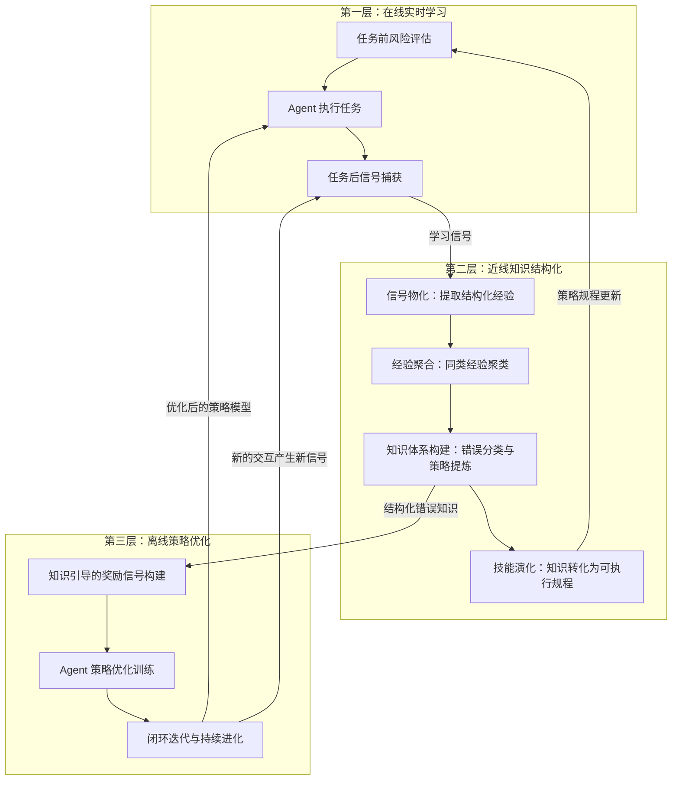
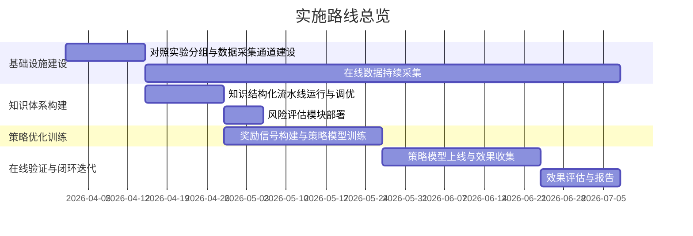

# DeskClaw AI Agent 自进化学习能力改进方案

---

## 一、问题背景

### 1.1 AI Agent 面临的核心挑战：策略层面"学不会"

随着大语言模型（LLM）驱动的 AI Agent 在软件开发、运维、客服等领域的广泛部署，一个关键缺陷日益凸显——**Agent 无法从历史交互中学习并改进自身的决策策略**。具体表现为：

- **同类策略错误反复发生**：Agent 在任务 A 中因策略失误而失败，用户纠正后，面对任务 B 中的相似场景时仍然犯同样的错误。即使 Agent "记得"之前的对话内容，也无法将纠正信息抽象为可迁移的通用策略。

- **失败经验碎片化，无法形成可执行规程**：用户反复纠正 Agent 的同类错误，但这些纠正信息被零散地记录在对话历史中，从未被系统性地整理为"遇到某类场景时应采取何种策略"的结构化知识。

- **风险操作缺乏前置拦截**：Agent 在执行不可逆操作（如删除文件、强制推送代码、清除数据库等）前，没有基于历史失败模式的预警机制。所有学习都发生在事后——先犯错，再补救。

- **学习反馈信号粗糙**：生产环境中 Agent 仅能获得任务级别的成功/失败信号，缺乏步骤级别的策略诊断依据。用户主动纠正是最高价值的学习信号，但频率低、表述随意，难以自动化利用。

- **多用户经验无法跨场景复用**：每个 Agent 实例独立摸索，用户 A 踩过的坑用户 B 依然会踩。不同业务场景的最佳实践无法跨用户沉淀和分发。

### 1.2 与"记忆丢失"问题的区分

需要明确的是，本改进方案解决的不是 Agent "记不住"的问题（记忆存储与检索机制缺陷），而是 Agent **"学不会"**的问题——即从交互错误中**提炼可迁移策略、结构化沉淀、并前置应用**的能力缺陷。

| 维度 | "记不住"（记忆问题） | "学不会"（策略学习问题） |
|------|-------------------|----------------------|
| 核心缺陷 | 记忆存储与检索链路 | 经验提炼、结构化与前置应用链路 |
| 典型表现 | 隔夜忘记昨天的交互 | 纠正后下次同类任务仍犯同样错误 |
| 知识形态 | 原始对话片段 | 分类化的错误模式、可执行的策略规程 |
| 作用时机 | 事后回忆 | 事前拦截 + 事后学习 |
| 作用范围 | 单用户单会话 | 可跨用户、跨场景、跨任务迁移 |

### 1.3 行业现状与不足

当前国内外在 Agent 自我改进领域的研究主要存在两类局限：

1. **只做知识提取，不做策略优化**：部分方案能从 Agent 的历史交互中提取技能或经验规则，但这些知识仅以文本提示的方式注入下一次执行，Agent 的底层决策策略并未真正改变。

2. **知识提取与策略优化相互隔离**：部分先进方案虽然同时具备知识提取和策略优化两个模块，但两者之间缺乏联动——提取出的结构化知识没有被用于指导策略优化过程，策略优化只能依赖粗粒度的任务成败信号，学习效率低下。

DeskClaw（Nanobot）作为面向企业和个人用户的 AI Agent 产品，拥有 200 日活跃用户（DAU）的真实部署基础，这些用户覆盖软件开发、运维、写作、客服等多种业务场景，为解决上述问题提供了得天独厚的数据条件和验证环境。

---

## 二、改进目标

本方案的核心目标是让 DeskClaw AI Agent 具备**从交互经验中持续学习并改进自身决策策略**的能力，具体分解为以下三个能力提升方向：

### 2.1 学会后不再犯——同类错误收敛能力

建立从错误中学习的完整闭环：当 Agent 在某类任务中犯错后，系统能够自动提炼错误模式并构建结构化的错误知识体系；该知识被用于指导 Agent 的策略优化，使 Agent 在未来遇到同类场景时能够采取正确策略，而非重蹈覆辙。

**核心度量**：同类错误在首次发生后的重复率应随时间持续下降。

### 2.2 事前风险拦截——从事后复盘转为事前预防

在 Agent 执行任务前，基于已积累的错误知识体系对即将执行的操作进行风险评估。对于已知的高风险模式（如不可逆操作、历史高频失败场景），主动向 Agent 提供风险提示和推荐策略，实现"防患于未然"。

**核心度量**：已知风险模式的命中率和拦截后的任务成功率。

### 2.3 经验可复用、可迁移——行业知识沉淀能力

单个用户的经验教训能够经过脱敏、聚合和结构化处理后，形成可跨用户、跨场景复用的行业知识资产。新用户或新场景能够直接受益于已有的集体智慧，缩短冷启动周期。

**核心度量**：新用户在知识预置场景下的首次任务成功率对比。

---

## 三、技术改进方案总体架构

本方案设计了一套**三层自进化学习架构**，覆盖从在线实时响应到离线深度优化的完整学习周期。三层在不同时间尺度上运作，形成持续迭代的学习闭环。

### 3.1 架构总览

### 3.2 第一层：在线实时学习

运行在 Agent 每一次任务执行过程中，对用户**零感知延迟**。

**任务前**：基于已积累的错误知识体系，对即将执行的任务进行快速风险评估。采用轻量级的本地索引匹配（响应时间 < 50ms），仅在命中已知风险模式时才触发深度分析，兼顾安全性与效率。

**任务后**：自动判断本次任务是否产生了有价值的学习信号。捕获五类信号源：用户主动纠正、未解决的错误、自行恢复的错误、首次使用的新工具、效率异常。信号以轻量化格式写入缓冲区，不阻塞用户交互。

### 3.3 第二层：近线知识结构化

在信号积累到一定量或 Agent 空闲时自动触发，负责将零散的学习信号转化为结构化的知识资产。

核心处理流程：

1. **信号物化**：回溯完整的会话记录，将轻量信号扩展为包含场景描述、错误签名、根因分析、解决方案和可迁移洞察的完整经验记录。

2. **经验聚合**：对同类经验进行语义聚类，识别反复出现的错误模式。

3. **错误分类体系构建**：从聚类结果中提炼结构化的错误分类条目，包含触发条件、标准修复流程和预防策略，形成层次化的错误知识体系。

4. **技能演化**：将高置信度的知识条目转化为 Agent 可直接使用的策略规程，并反馈更新第一层的风险评估索引。

### 3.4 第三层：离线策略优化

本架构的核心差异化能力。利用第二层构建的结构化错误知识体系，指导 Agent 底层策略模型的优化训练。

关键设计理念：

- **知识引导的奖励信号**：不同于传统方法仅依赖任务成败的粗粒度奖励，本方案将结构化的错误知识转化为步骤级别的精细奖励信号，为策略优化提供更明确的学习方向。

- **策略模型微调**：基于知识引导的奖励信号，对 Agent 的策略模型进行参数高效的微调训练，在有限算力（单张消费级 GPU）条件下即可完成。

- **闭环迭代**：优化后的策略模型部署回生产环境后，新的交互数据会持续进入学习流水线，形成"执行 → 学习 → 优化 → 再执行"的持续进化循环。

### 3.5 三层协同机制

三层在不同时间尺度上运作，相互支撑：

| 层级 | 执行频率 | 处理时长 | 核心输入 | 核心输出 |
|------|---------|---------|---------|---------|
| 第一层 | 每次任务 | 毫秒级 | 当前任务 + 知识索引 | 风险提示 + 学习信号 |
| 第二层 | 信号积累后 | 分钟级 | 学习信号 + 会话记录 | 结构化知识体系 |
| 第三层 | 周期性 | 小时级 | 知识体系 + 交互轨迹 | 优化后的策略模型 |

---

## 四、关键创新点

### 4.1 结构化错误知识与策略优化的深度联动

现有方案中，知识提取模块和策略优化模块通常是相互独立的：知识提取的产出仅用于文本提示注入，策略优化仅依赖粗粒度的任务成败信号。本方案首次将结构化的错误知识体系作为策略优化过程的核心引导信号，使每一次策略更新都能被追溯到具体的知识条目，实现知识驱动的精准策略改进。

### 4.2 任务执行前的主动风险拦截

区别于现有方案普遍采用的"事后反思"模式，本方案在 Agent 执行任务之前即进行基于历史错误模式的风险预判。通过轻量级的本地索引匹配，在不影响用户体验的前提下实现"学会后不再犯"的前置拦截能力。

### 4.3 面向真实生产环境的闭环验证

本方案不依赖模拟环境或离线基准测试集，而是在拥有 200 DAU 真实用户的生产系统上进行端到端验证。通过在线对照实验，直接度量学习系统对真实用户体验的改善效果，确保研究结论的工业可信度。

### 4.4 经验知识的自动化提炼与持续进化

学习流水线全程自动化运行，无需人工标注或干预。从信号捕获、经验物化、知识聚合到策略优化，均由系统自主完成。知识体系随着用户交互数据的持续积累而不断进化和自我修正。

---

## 五、预期效果与验证指标

### 5.1 核心效果指标

| 指标 | 含义 | 预期改善方向 |
|------|------|------------|
| 同类错误重复率 | 同一类型错误在首次发生后的再次出现频率 | 显著下降 |
| 用户纠正频率 | 每百次任务中用户主动纠正 Agent 的次数 | 持续降低 |
| 整体错误密度 | 每百次任务中触发学习信号的比例 | 持续降低 |
| 风险拦截命中率 | 风险评估模块成功识别已知风险的比例 | 持续提升 |
| 学习曲线斜率 | 上述指标随时间的改善速度 | 策略优化组改善速度快于对照组 |

### 5.2 验证方案

基于 DeskClaw 200 DAU 的真实用户基础，采用在线对照实验方式验证改进效果：

- **对照组设计**：将用户随机分组，分别部署无学习能力的基线版本、仅有知识结构化能力的版本、以及包含完整策略优化的版本。
- **数据规模**：预计在验证周期内累积数万次真实用户交互会话和数千条学习信号，数据规模远超同类研究中常用的模拟测试集。
- **统计检验**：采用 bootstrap 置信区间和非参数检验方法，确保组间差异的统计显著性。
- **辅助离线消融**：在留出的测试数据上进行消融实验，验证各模块的独立贡献。

### 5.3 与同类方案的验证强度对比

| 维度 | 国内外同类方案 | 本方案 |
|------|-------------|--------|
| 数据来源 | 模拟环境或标准测试集 | 200 DAU 真实用户交互 |
| 数据规模 | 百至千级测试样本 | 万级真实会话 |
| 评测方式 | 离线基准评测 | 在线对照实验 + 离线消融 |
| 反馈信号 | 模拟反馈 | 真实用户纠正信号 |

---

## 六、实施路线

本方案的实施分为四个阶段，各阶段相互衔接并可部分并行推进：

### 阶段一：基础设施建设与数据采集

- 建立在线对照实验的分组机制和数据采集通道
- 部署第一层的信号捕获模块，开始积累真实用户交互数据
- 在各实验组上收集基线期数据，确保分组间的初始一致性

### 阶段二：知识体系构建

- 基于阶段一积累的真实信号数据，运行第二层的知识结构化流水线
- 构建覆盖软件开发、运维、写作等多业务场景的错误分类体系
- 部署任务前风险评估模块，实现前置拦截能力

### 阶段三：策略优化训练

- 基于阶段二产出的结构化知识体系，构建知识引导的奖励信号
- 对 Agent 策略模型进行参数高效的微调训练
- 通过多轮迭代优化，逐步提升策略模型质量

### 阶段四：在线部署与闭环验证

- 将优化后的策略模型部署到实验组用户
- 持续采集在线效果数据，进行对照分析
- 新数据持续进入学习流水线，形成闭环迭代
- 汇总验证结果，完成效果评估报告

---

## 七、技术优势与竞争力分析

### 7.1 与行业现有方案的差异化优势

| 能力维度 | 行业方案 A（仅知识提取） | 行业方案 B（知识提取 + 策略优化，但二者隔离） | 本方案 |
|---------|----------------------|------------------------------------------|--------|
| 知识提取 | 支持 | 支持 | 支持 |
| 策略优化 | 不支持 | 支持（但与知识隔离） | 支持（知识引导策略优化） |
| 知识→策略联动 | 无 | 无 | **有：结构化知识直接引导优化过程** |
| 事前风险拦截 | 无或仅提示注入 | 无 | **有：基于知识体系的前置拦截** |
| 验证方式 | 离线评测 | 离线评测 | **在线对照实验 + 离线消融** |
| 数据来源 | 模拟或标准测试集 | 模拟或标准测试集 | **真实用户生产数据** |

### 7.2 核心竞争力总结

1. **完整闭环**：从信号捕获、知识结构化、策略优化到前置拦截，形成端到端的自进化学习闭环。知识不仅被提取，更被直接用于驱动策略改进。

2. **真实场景验证**：基于 200 DAU 真实用户的生产环境进行验证，覆盖多种业务场景，数据规模和验证强度大幅超越依赖模拟环境的同类方案。

3. **产业落地可行性**：方案设计充分考虑工程约束——在线层对用户零感知延迟，策略优化可在单张消费级 GPU 上完成，无需大规模算力投入。

4. **知识资产可沉淀**：构建的错误分类体系和策略规程具备跨用户、跨场景复用的潜力，可作为行业知识资产持续积累，形成数据壁垒。

5. **可解释性**：每一次策略改进都可追溯到具体的错误知识条目，相比黑盒式的策略优化方案，具备更高的可解释性和可审计性。

---

## 附录：术语说明

| 术语 | 含义 |
|------|------|
| AI Agent | 基于大语言模型驱动的智能助手，具备工具调用和多轮交互能力 |
| DeskClaw / Nanobot | 本公司研发的 AI Agent 产品 |
| DAU | Daily Active Users，日活跃用户数 |
| 学习信号 | Agent 任务执行过程中产生的有学习价值的事件（如错误、纠正、效率异常等） |
| 错误分类体系 | 从大量学习信号中提炼出的结构化错误模式知识库 |
| 策略模型 | Agent 进行决策和行动的底层模型 |
| 策略优化 | 通过训练改进 Agent 策略模型的决策能力 |
| 前置拦截 | 在 Agent 执行任务前基于历史知识进行风险评估和预警 |
| 闭环迭代 | 系统产出的改进通过部署反馈回系统，形成持续优化的循环 |
| 对照实验 | 将用户随机分组，对比不同版本的效果差异 |
