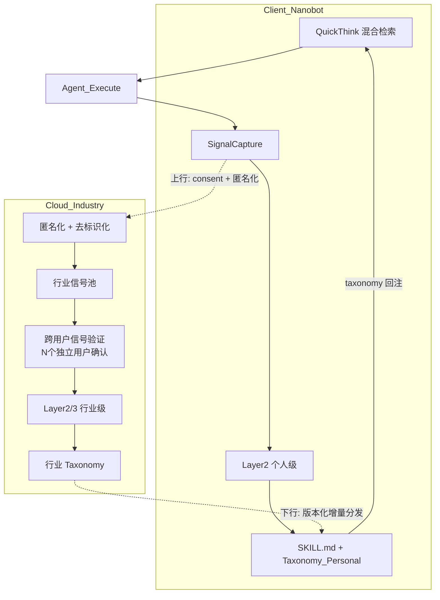

# Meta-Learning 同类工作与创新点研究报告

> 检索日期：2026-03-31 当周 | 文献来源：arXiv、GitHub、官方博客 | 架构参考：[`meta_learning_chain_fusion.drawio`](meta_learning_chain_fusion.drawio)

---

## 第一章：研究背景与方法

### 1.1 问题空间

2025–2026 年，LLM Agent 领域出现了一个明确的研究趋势：**如何让 Agent 从交互经验中持续学习，而不依赖模型参数更新**。这一趋势的核心动机是：

- LLM 在部署后是静态的，无法自适应新任务或用户偏好
- 用户反复表达的纠正/偏好被浪费，未被沉淀为可复用知识
- 手动维护 Agent 技能和规则的成本随复杂度指数增长

两篇综述论文系统性地归纳了这一领域（[2507.21046](https://arxiv.org/abs/2507.21046)、[2508.07407](https://arxiv.org/abs/2508.07407)），将自进化 Agent 的研究组织为「evolve what / when / how」三维框架。

### 1.2 检索范围与方法

- **学术论文**：arXiv 2025.06 – 2026.03，关键词覆盖 self-evolving agent、skill evolution、meta-learning、memory evolution
- **工业产品**：Cursor Composer 1.5 real-time RL 系统、GitHub Copilot
- **协议/生态**：MCP (Model Context Protocol) Skills 2.0、experimental-ext-skills Interest Group
- **核对方式**：论文 abstract + method + experiments 精读；开源 repo 代码验证

### 1.3 本项目定位

本项目（灵敏 Meta-Learning）是一个面向 Agent 的三层策略与流程学习系统，架构为 online / nearline / offline 三层解耦，核心流水线为 signal → experience → taxonomy → skill，在 Layer 1 提供 QuickThink 事前风险评估。完整架构见 [`meta_learning_chain_fusion.drawio`](meta_learning_chain_fusion.drawio)，能力边界见 [README.md](README.md)。

---

## 第二章：文献矩阵

以下对比覆盖 7 篇学术论文、1 个工业系统和 1 个协议生态。

### 2.1 AutoSkill（arXiv 2603.01145, 2026.03）

- **核心问题**：用户在交互中反复表达的偏好（减少幻觉、遵循写作惯例等）未被沉淀为可复用知识
- **机制**：从对话 trace 提取 skill → skill 自演进（merge + version update）→ 动态注入未来请求；模型无关的插件层
- **是否改参数**：否
- **实验证据**：开源实现（GitHub ECNU-ICALK/AutoSkill），含 Web UI / API proxy / Docker 部署；有 AutoSkill4Doc 和 AutoSkill4OpenClaw 变体
- **与我们的关系**：**最接近竞品**。同样不改参数、从交互抽 skill。核心差异：AutoSkill 是 flat 结构（skill list + embedding 检索），我们是三级 taxonomy + 混合检索 + 事前拦截。AutoSkill 无事前风险评估环节。

### 2.2 MemEvolve（arXiv 2512.18746, 2025.12）

- **核心问题**：Agent 的记忆架构是静态的，无法适应不同任务上下文
- **机制**：bilevel optimization 联合进化记忆内容 + 记忆架构（encode/store/retrieve/manage 四模块均可变异）；引入 EvolveLab 统一 12 种记忆系统
- **是否改参数**：否（知识面进化）
- **实验证据**：4 个 benchmark（GAIA, WebWalkerQA 等），最高 +17.06% 性能提升；跨任务、跨 LLM 泛化
- **与我们的关系**：MemEvolve 进化的是**记忆架构**（how to store/retrieve），我们进化的是**策略知识**（what was learned）。我们的 Layer 3 MemoryArchitect 概念上与其对标，但 MemEvolve 真正执行架构变异，而我们仅产出建议且不回流。

### 2.3 MemSkill（arXiv 2602.02474, 2026.02）

- **核心问题**：记忆操作（提取/整合/裁剪）是静态规则，无法自适应
- **机制**：将记忆操作重构为可学习的 memory skills；三组件闭环——Controller（技能选择）+ Executor（技能执行）+ Designer（从 hard cases 进化技能集）
- **是否改参数**：否
- **实验证据**：LoCoMo, LongMemEval, HotpotQA, ALFWorld 四项 benchmark；跨 base model 迁移
- **与我们的关系**：MemSkill 的 closed-loop（Designer 从 hard case 进化 skill set）是我们缺少的闭环设计。我们的 Layer 3 检测盲区但不自动更新 taxonomy/skill。

### 2.4 MetaAgent（arXiv 2508.00271, 2025.08）

- **核心问题**：Agent 缺乏自主发现和构建工具的能力
- **机制**：learning-by-doing 范式，从最小能力起步；tool router + self-reflection + in-house tool builder + persistent knowledge base
- **是否改参数**：否
- **实验证据**：GAIA, WebWalkerQA, BrowseCamp 三项 benchmark；匹配或超越 end-to-end trained agents
- **与我们的关系**：MetaAgent 聚焦**工具发现与构建**，我们聚焦**错误模式提炼与风险拦截**，问题域互补。我们的 `new_tool_usage` 信号类型与其工具发现有概念交叉。

### 2.5 AutoAgent（arXiv 2603.09716, 2026.03）

- **核心问题**：长期经验学习与实时上下文决策之间的脱节
- **机制**：三组件耦合——Evolving Cognition（prompt 级认知持续更新）+ Contextual Decision-Making + Elastic Memory Orchestration（动态压缩/抽象交互历史）
- **是否改参数**：否
- **实验证据**：retrieval-augmented reasoning、tool-augmented agent、embodied task 三类 benchmark
- **与我们的关系**：AutoAgent 的 Evolving Cognition（工具知识、自身能力、同伴专长的 prompt 级认知更新）与我们的 SKILL.md 注入有相似设计意图。差异在于 AutoAgent 是多 Agent 框架，我们是单 Agent 学习系统。

### 2.6 HyperAgents / Darwin Godel Machine（Meta, ICLR 2026, arXiv 2603.19461）

- **核心问题**：Agent 的自改进机制本身是固定的，无法被优化
- **机制**：task agent + meta agent 集成于单个可编辑程序；meta-level 修改过程本身可被修改（metacognitive self-modification）；基于 DGM 的变体生成、测试、保存
- **是否改参数**：是（修改自身代码/流程）
- **实验证据**：coding, paper review, robotics reward design, Olympiad math grading 四领域；robotics 从 0.0 → 0.710；跨领域迁移
- **与我们的关系**：最激进的自进化方案。我们不修改自身代码/流程，只修改知识库——这是一个**保守但安全**的设计选择。在生产环境部署中，self-modification 的风险远高于 knowledge-only 进化。

### 2.7 MetaClaw（arXiv 2603.17187, 2026.03）

- **核心问题**：如何在不中断服务的情况下持续改进 Agent
- **机制**：双机制互增强——Skill-Driven Fast Adaptation（零停机，从失败 trace 合成 skill）+ Opportunistic Policy Optimization（空闲时段 cloud LoRA fine-tune + RL-PRM）；OMLS 调度器监测用户不活跃窗口
- **是否改参数**：是（LoRA 微调），但 skill adaptation 不改参数
- **实验证据**：MetaClaw-Bench + AutoResearchClaw；skill adaptation +32% 准确率；full pipeline 21.4% → 40.6%（接近 GPT-5.2 baseline 41.1%）
- **与我们的关系**：MetaClaw 的 skill-driven adaptation 与我们的 taxonomy/skill 管道最为相似，但它额外做了参数级微调。我们的纯知识面方案部署成本更低（不需要 GPU），但效果天花板可能也更低。

### 2.8 Cursor Composer 1.5 Real-Time RL（工业产品, 2026.02）

- **核心问题**：如何利用海量用户交互数据持续改进 coding agent
- **机制**：client-side instrumentation → 用户交互转化为 reward signal → real-time on-policy RL training → 每 5 小时更新 checkpoint → A/B test + CursorBench 回归测试 → 部署
- **是否改参数**：是（RL 更新权重）
- **实验证据**：20x RL compute vs v1；+2.28% edit persistence, -3.13% dissatisfied follow-ups, -10.3% latency
- **与我们的关系**：**本质上是我们的「真正竞争对手」**。Cursor 通过遥测 + RLHF 隐式地做跨用户学习，但不透明、不可审查、不可迁移。我们的差异化应该是：**显式的、可审查的、用户可控的知识沉淀**。但效果维度上，参数级 RL 几乎必然优于纯知识面注入。

### 2.9 MCP Skills 生态（experimental-ext-skills, 2026.01–03）

- **核心定位**：标准化 Agent skill 的发现与分发机制
- **现状**：Skills Over MCP Interest Group（2026.02 成立）探索 skill 通过 `resources/list` + `resources/read` 原生发现；已完成 model-driven resource loading 原型；尚在讨论 skill as tool vs resource vs registry metadata vs protocol primitive
- **与我们的关系**：我们的 `sync_taxonomy_to_nobot` 和 SKILL.md 写文件机制是**自定义的、非标准的**。如果 MCP Skills 标准化了 skill 发现协议，我们需要对齐，否则成为孤岛。

---

## 第三章：本项目创新点分析

### 3.1 写作原则

对每条创新主张，区分「科学问题新异性」与「产品/工程差异」，配套反驳与验证需求。

### 3.2 可辩护的差异点

#### 差异 1：online / nearline / offline 三层解耦 + 五级沉淀管道

**主张**：本系统将学习过程显式分为 Layer 1（实时 QuickThink + 信号捕获）→ Layer 2（近线物化 + 聚类 + taxonomy + skill）→ Layer 3（离线跨任务挖掘 + 盲区检测 + 记忆建议），信号经历 signal → experience → cluster → taxonomy_entry → skill 五级沉淀。相比 AutoSkill 的 flat 结构（dialogue → skill → inject），结构化程度更深。

**解决的子问题**：在 B2B 行业沉淀场景下，按 domain/subdomain 聚合错误模式，使不同行业（前端 / DevOps / 客服）的经验可以独立管理和分发。flat list 在行业 taxonomy 规模增长时缺乏组织能力。

**反驳**：

- 结构化程度更深 ≠ 效果更好。五级管道引入大量中间态（`signal_buffer/*.yaml`、`experience_pool/*.yaml`、`index.yaml`、`taxonomy.yaml`、`skills/`），每级都依赖 LLM 调用，每次调用都有 JSON 解析失败的风险。
- 目前**没有实验证据**证明三级 taxonomy 比 flat embedding 检索产出更好的 QuickThink 命中率或任务成功率。
- 现有的 [gdpval_meta-learning_validation 计划](.cursor/plans/gdpval_meta-learning_validation_cb51c142.plan.md) 是验证这一命题的起点，但实验尚在进行中。

**科学新异性**：低。分层学习和 taxonomy 在传统 ML 中不新。

**产品/工程差异**：中。若多用户行业沉淀做成，分层管道自然映射到客户端 vs 云端部署拓扑。

#### 差异 2：QuickThink 事前风险评估

**主张**：多数同类工作（AutoSkill、MetaAgent、MemEvolve、MemSkill）只做**事后学习**——从错误中提取 skill 供未来注入。本系统在 Agent **执行前**通过 QuickThink 做风险评估，对任务上下文做混合检索（关键词 + 向量），命中已知错误模式时产出风险提示。

**解决的子问题**：不可逆操作（`rm -rf`、`force push`）和已知失败模式的**预防**，而非事后补救。

**反驳**：

- QuickThink 当前实现本质是**规则引擎 + 关键词/向量匹配**，不是"学习"。四个检测维度中，只有 `keyword_taxonomy_hit` 和 `recent_failure_pattern` 随 taxonomy 增长而增强，`irreversible_operation` 和 `new_tool_usage` 是静态配置。
- 事前拦截的价值高度依赖命中率。如果 taxonomy 稀疏（冷启动期），QuickThink 几乎不会命中。如果 taxonomy 噪音多（LLM 提取质量低），会产生大量 false positive，反而降低用户信任。
- MetaClaw 的 skill-driven fast adaptation 也在执行前注入 skill（类似事前），但它不单独称之为"风险评估"，而是作为 prompt 增强。

**科学新异性**：低。pre-task risk assessment 在工业安全领域是常识。

**产品/工程差异**：中高。在 B2B 场景中，"全公司用户踩过的坑，你一个都不会再踩"有明确的产品价值和营销叙事。

#### 差异 3：显式、可审查的知识库

**主张**：相比 Cursor/Copilot 的隐式遥测 + RLHF（用户不知道 Agent 学了什么、无法审查/修正），本系统的 taxonomy 和 skill 以 YAML/Markdown 文件形式存在，用户可以阅读、编辑、删除。

**解决的子问题**：合规/审计场景需要知道 Agent 学了什么；用户需要对知识库有控制权（如删除过时的规则、修正错误的 taxonomy entry）。

**反驳**：

- 显式 ≠ 更好的效果。Cursor 1.5 通过 RL 获得的 +2.28% edit persistence 是真实可度量的改善；我们没有可比的效果数据。
- YAML/Markdown 文件的可读性对非技术用户几乎为零。真正的"可审查"需要 UI/dashboard，而不是文件系统。
- 在行业沉淀场景下，如果 taxonomy 有数千条目，手动审查不现实。需要自动化的质量评估机制。

**科学新异性**：低。知识库的可解释性是 XAI 的经典主题。

**产品/工程差异**：中。在 toB 合规场景（金融、医疗）中，"可审查的 AI 学习过程"可能是差异化卖点。

#### 差异 4：多用户行业沉淀潜力

**主张**：所有学术论文（AutoSkill、MetaAgent、MemEvolve、MemSkill、MetaClaw）都是单用户/单 Agent 的本地学习。本系统的架构设计预留了多用户聚合的潜力：三层分离自然映射到「客户端 Layer 1-2 / 云端 Layer 2-3」的部署拓扑，taxonomy 的 domain/subdomain 结构支持行业级聚合。

**解决的子问题**：network effect——用户量 × 信号密度 × taxonomy 质量 = 竞争壁垒。一个新用户接入即获得全行业的错误模式知识。

**反驳**：

- **当前实现为零**。`Signal` 无 `user_id`，`TaxonomyEntry` 无 `source_scope`，无上行/下行通道，无隐私框架，无跨用户信号验证。这不是"预留了潜力"，而是"需要重新设计数据模型和基础设施"。
- 多用户聚合引入新问题：信号质量不均（用户纠正可能是错的）、偏好冲突（4 空格 vs tab）、隐私合规（GDPR/数据驻留）。
- Cursor 已经通过隐式遥测在做跨用户学习——虽然不透明，但已部署、已有数据支撑。

**科学新异性**：中。federated experience distillation for agents 在学术界尚未被系统研究。

**产品/工程差异**：高（如果做成）。但当前处于概念阶段，需大量基础设施补建。

### 3.3 综合判断

**科学问题层面**：本项目没有解决一个别人完全没碰过的问题。「不改权重、从 trace 抽可复用知识」在 2025-2026 已被 AutoSkill、MetaAgent、MemEvolve 等覆盖。

**产品/工程层面**：本项目有三个可辩护但需验证的差异点——(1) 事前风险拦截、(2) 显式可审查知识库、(3) 多用户行业沉淀潜力。其中 (3) 是真正的壁垒所在，但也是当前离实现最远的。

---

## 第四章：多用户/行业沉淀 — 应然架构 vs 实然代码

### 4.1 应然数据流

### 4.2 实然代码现状

**全量对照清单**：

- **数据模型**
  - `Signal`：无 `user_id`、无 `uploadable`、无 `consent_status`、无 `anonymized`
  - `TaxonomyEntry`：无 `source_scope`（personal / team / industry）、无 `version`、无 `supersedes`
  - `Experience`：无 `contributing_users_count`

- **数据通道**
  - 上行：不存在。`SignalCapture` 仅写入本地 `signal_buffer/*.yaml`
  - 下行：不存在。`sync_taxonomy_to_nobot` 是本地文件写入，不是从云端拉取

- **隐私与合规**
  - 无匿名化管道
  - 无用户 consent 机制
  - `Signal` 中 `task_summary`、`error_snapshot`、`user_corrections`、`resolution_snapshot` 可能含敏感数据
  - `DashScopeConfig` 存在硬编码 dev API key fallback

- **信号质量治理**
  - 无跨用户验证（同一模式被 N 个独立用户确认后才升级为行业级）
  - `confidence` 字段仅由 LLM 输出决定，无基于实际使用效果的强化/衰减

- **Taxonomy 合并**
  - 无 personal vs industry 分层
  - 无冲突策略（同名条目来自不同用户时如何合并）

- **存储**
  - 全 YAML 文件系统，无并发写入保护
  - 无事务性，多客户端同时写入会冲突

### 4.3 差距评估

当前代码是一个完整的**单用户本地原型**。从原型到多用户产品化，需要补建的基础设施包括但不限于：

- 数据模型扩展（`user_id`、`source_scope`、`version`、`consent_status`）
- 信号上行 API（客户端 SDK → 云端信号收集服务）
- 匿名化管道（PII 剥离、路径/凭据脱敏）
- 云端 Layer 2/3（分布式信号聚合 + taxonomy 生成）
- 跨用户信号验证（投票/确认机制）
- Taxonomy 版本管理 + 增量分发协议
- Personal / team / industry 三级 taxonomy merge 策略
- 对齐 MCP Skills 标准（通过 `resources/list` + `resources/read` 发现 skill，而非自定义文件写入）

### 4.4 与 MCP Skills 标准的对齐建议

当前的 `sync_taxonomy_to_nobot` 和 SKILL.md 文件写入是自定义机制。MCP `experimental-ext-skills` Interest Group 正在探索：

- 通过 `resources/list` 让客户端发现可用 skills
- 通过 `resources/read` 获取 skill 内容并注入 model context
- Model-driven resource loading 原型已完成

如果本系统的 skill 能以 MCP resource 形式暴露（已有 `meta-learning://taxonomy` resource），且遵循 MCP Skills 的 URI 约定和 metadata schema，则可以被任意 MCP 兼容客户端发现和消费，而非仅限于 Nanobot/DeskClaw。

---

## 第五章：结论与下一步

### 5.1 是否有创新？

**诚实的回答**：

- 在**科学问题**层面——**不新**。「不改权重、从 trace 抽可复用知识」已是 2025-2026 的论文簇主题。
- 在**产品/工程**层面——**有差异，但需验证**。三个可辩护的差异点（事前拦截、显式知识库、多用户行业沉淀）在学术论文中未被系统探索，但它们的价值需要实验数据支撑。
- 在**商业**层面——**多用户行业沉淀若做成，是有网络效应壁垒的差异化**。但当前实现距此目标有根本性的架构缺口。

### 5.2 创新的条件与边界

每条创新主张成立的前提：

- **事前拦截有价值** ← 需证明 QuickThink 命中率 > X%、命中后 Agent 采纳率 > Y%、采纳后任务成功率提升 > Z%
- **三级 taxonomy 优于 flat** ← 需 A/B 实验对比 taxonomy 检索 vs flat embedding 检索的命中精度与下游任务成功率
- **多用户行业沉淀可行** ← 需先补建数据模型 + 上下行通道 + 隐私框架，再在真实多用户环境中验证信号聚合质量

### 5.3 建议的优先级

1. **先证明单用户价值**：完成 [gdpval_meta-learning_validation 计划](.cursor/plans/gdpval_meta-learning_validation_cb51c142.plan.md) 的跨任务迁移实验，获得有无 taxonomy 注入的 A/B 对比数据
2. **补建闭环度量**：在 QuickThink 中记录命中后的 Agent 行为（采纳/忽略）和任务结果，建立因果链证据
3. **让 Layer 3 回流**：将 CrossTaskMiner 和 NewCapabilityDetector 的输出自动注入 taxonomy 更新流程，关闭开环
4. **数据模型扩展**：给 `Signal` 加 `user_id`、给 `TaxonomyEntry` 加 `source_scope`——即使暂不做云端，也为未来多用户场景做好数据结构准备
5. **对齐 MCP Skills**：关注 `experimental-ext-skills` 进展，确保 skill 可通过 MCP 原生协议发现

### 5.4 与竞品的最终定位

- **对学术论文**：我们不是科学突破，是工程与产品层面的差异化选择
- **对 Cursor/Copilot**：我们是「显式、可审查、用户可控」的替代路线，目标客群是对 AI 知识库透明度有要求的 B2B 场景
- **对 MCP 生态**：我们是 MCP Skills 标准的**内容生产者**（自动生成 skill），而非仅仅是分发框架——如果能对齐协议，这是有价值的互补
