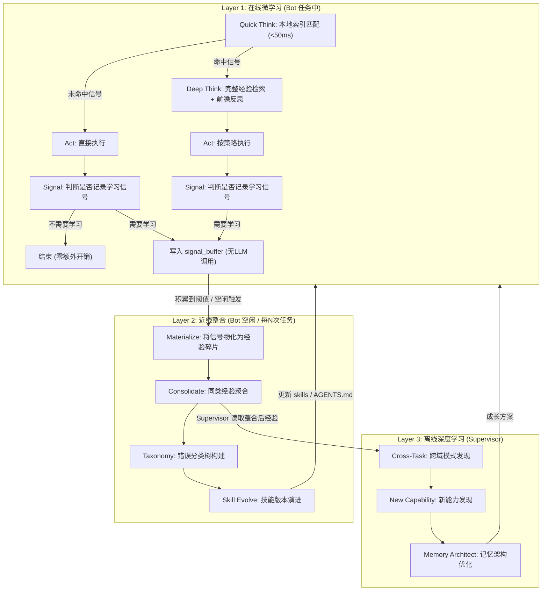
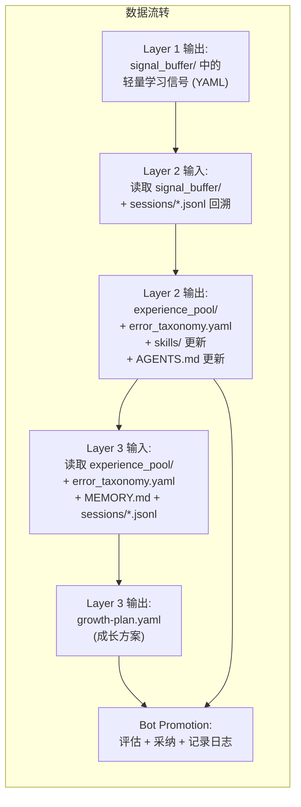

# OpenClaw 三层自进化学习架构：Supervisor + 小学习融合方案

> **版本：** 1.1 (2026-03-09)
> **状态：** 设计稿
> **前置方案：** [agent-supervisor-growth-proposal.md](agent-supervisor-growth-proposal.md) (Supervisor 架构) | [SOP_logic.md](SOP_logic.md) (小学习 SOP)
> **v1.1 修订：** 基于 `~/.openclaw/` 实际文件结构校准。修正了对不存在的 `HISTORY.md` 的引用；确认 sessions 存储于 `agents/main/sessions/*.jsonl`；所有数据源对齐 OpenClaw 真实布局。

---

## 一、问题分析

### 两个方案各自的定位

| 维度 | 小学习 (SOP_logic.md) | Supervisor (agent-supervisor-growth-proposal.md) |
|------|----------------------|-----------------------------------------------|
| 时机 | 任务中 / 任务后立即执行 | 空闲时（6h+ 间隔） |
| 视角 | 单任务内（微观） | 跨任务（宏观） |
| 产出 | META-Learning 卡片（原始经验碎片） | 成长方案（YAML 结构化建议） |
| 执行者 | Bot 自身 | 外部 Supervisor Agent |
| 优势 | 即时性强，细节丰富 | 全局视角，能发现跨任务模式 |
| 缺陷 | 自我分析存在盲区，无法看到跨任务规律 | **缺乏具体的学习算法**，"分析"停留在 prompt 层面 |

### 核心判断

两者**天然互补**，操作在不同时间尺度和不同抽象层级上。小学习产出"原材料"，Supervisor 做"深加工"。融合后形成完整的学习闭环。但 Supervisor 目前的学习步骤过于模糊——仅用一段 prompt 让 LLM "分析工作记录"是不够的。需要引入结构化的学习算法。

---

## 二、融合架构：三层学习模型

核心思路来源于 SAMULE (EMNLP 2025) 的多层反思框架，结合 PreFlect 的前瞻反思和 AutoSkill 的技能自进化：



三层各自的学习时机和职责：

- **Layer 1 (在线微学习)** — 每个任务中实时运行。Bot 自己执行。**对用户零感知延迟**：大部分任务走 Quick Think 路径（< 50ms 本地索引匹配），仅高风险/匹配已知问题的任务触发 Deep Think。Refine 完全异步——任务中只记录轻量信号到缓冲区，不做任何 LLM 调用。产出：学习信号（非结构化碎片）。
- **Layer 2 (近线整合)** — 信号缓冲区积压 >= N 条、或距上次整合 >= 24 小时、或 Bot 空闲时触发。先将信号物化为结构化经验碎片，再做聚合和提炼。可以由 Bot 自己在空闲时执行，也可由 Supervisor 执行。产出：整合后的技能更新、错误分类树。
- **Layer 3 (离线深度学习)** — Supervisor 周期性执行（现有方案的 6h+ 间隔）。产出：跨域成长方案、新技能建议、记忆架构调整。

---

## 三、Layer 1: 增强版在线微学习（延迟优化设计）

核心原则：**任务主流程中零感知延迟**。学习的 token 和时间开销不应由用户承担。

### 3.1 Think 阶段：两级触发

将原 SOP 中的 Think 阶段拆分为 Quick Think 和 Deep Think 两级：

```
Quick Think（始终执行，< 50ms）:
  - 不调用 LLM
  - 对 error_taxonomy 的本地关键词索引做模式匹配
  - 检查任务是否命中以下信号：
    a) 关键词命中 error_taxonomy 中的已知错误类型
    b) 涉及不可逆操作（删除、覆写、force push 等）
    c) 任务类型在近期失败记录中出现过
    d) 涉及 Bot 未使用过的工具或 API
  - 未命中任何信号 → 直接进入 Act（零额外延迟）
  - 命中任意信号 → 进入 Deep Think

Deep Think（条件触发，约 ~20% 任务）:
  1. 经验检索：搜索 memory/ 和 MEMORY.md（完整语义搜索）
  2. 避坑分析：识别历史失败记录
  3. 前瞻风险预测（PreFlect 启发）：
     - 基于任务类型，预测 Top-3 可能的失败模式
     - 对每种失败模式，预生成应对策略
     - 若任务涉及不可逆操作，强制生成回滚方案后才执行
  4. 策略初始化：综合 1-3 形成执行 SOP
```

理论依据：PreFlect (arXiv:2602.07187) 证明前瞻反思在不可逆任务上显著提升成功率。但并非所有任务都需要——"帮我重命名这个变量"不值得做风险预测。两级触发兼顾了安全性和效率。

### 3.2 Refine 阶段：完全异步化

**Refine 不在任务主流程中执行。** 任务完成后仅做一个轻量判断 + 信号记录，所有实质性提炼推迟到 Layer 2。

```
任务完成后（立即，不阻塞用户响应）:
  1. 快速判断：本次任务是否值得学习？
     触发条件（任一命中即记录）：
     - 任务中出现过报错并修复
     - 用户给出负面反馈 / 纠正
     - 使用了新工具 / 新 API
     - 任务步骤数或耗时远超同类平均
     
     不触发：任务顺利完成且为常规操作
  
  2. 若触发：写入一条学习信号到 signal_buffer
     信号格式极轻量（无 LLM 调用）：
```

学习信号格式（signal_buffer 中的一条记录）：

```yaml
signal_id: sig-20260309-001
timestamp: "2026-03-09T14:30:00Z"
session_id: "0c3291ac-85c9-4b42-bf29-d77b32be4dcc"                # 对应 agents/main/sessions/{uuid}.jsonl
memory_date: "2026-03-09"                                          # 对应 memory/YYYY-MM-DD.md
trigger_reason: "self_recovery"       # user_correction | self_recovery | unresolved_error | new_tool | efficiency_anomaly
keywords: ["TS2345", "generic", "type inference"]
task_summary: "修复 React 组件的 TypeScript 类型错误"
error_snapshot: "TS2345: Argument of type X is not assignable..."  # 仅在 error_recovery 时填充
resolution_snapshot: "添加显式泛型参数"                              # 简短摘要，非完整分析
user_feedback: null                                                # 用户反馈原文（如有）
step_count: 7
```

**信号不是经验碎片。** 它只是一个"这次任务值得学习"的标记 + 最小必要上下文。真正的知识提炼（分析根因、提炼 meta insight、分配置信度）在 Layer 2 中由 LLM 完成。

> **上下文回溯**：OpenClaw 会话完整存储于 `~/.openclaw/agents/main/sessions/{uuid}.jsonl`（JSONL 格式，含消息、工具调用、模型信息）。Layer 2 物化时可通过 `session_id` 回溯完整对话轨迹，这比仅依赖日志有更丰富的上下文。

### 3.3 经验池（由 Layer 2 产出）

原方案中 Layer 1 直接输出结构化经验碎片到 experience_pool/。调整后，experience_pool/ 由 Layer 2 在物化阶段填充：

```
signal_buffer/                     # Layer 1 输出 — 轻量学习信号
├── sig-20260309-001.yaml
├── sig-20260309-002.yaml
└── ...

experience_pool/                   # 由 Layer 2 物化填充
├── index.yaml                     # 索引：任务类型 -> 碎片列表
├── coding/
│   ├── exp-001.yaml
│   └── exp-002.yaml
├── devops/
├── writing/
└── _unclassified/
```

经验碎片（exp-XXX.yaml）的格式：

```yaml
id: exp-001
task_type: coding
created_at: "2026-03-09T14:30:00Z"
source_signal: "sig-20260309-001"       # 追溯到触发信号
source_session: "0c3291ac-..."          # 对应 agents/main/sessions/{uuid}.jsonl
source_memory: "2026-03-09"             # 对应 memory/YYYY-MM-DD.md
confidence: 0.6
verification_count: 1

scene: "用户要求修复 React 组件的 TypeScript 类型错误"
failure_signature: "TS2345: Argument of type X is not assignable to parameter of type Y"
root_cause: "泛型约束不足导致类型推断失败"
resolution: "为函数添加显式泛型参数而非依赖推断"
meta_insight: "TypeScript 泛型推断在嵌套函数调用中易失败，复杂场景应显式标注"

related_exps: []
promoted_to: null
```

### 3.4 置信度机制

置信度由 Layer 2 在物化经验碎片时初始赋值，后续更新规则：

- 新物化的经验碎片：初始置信度 0.6
- 被后续任务的 Quick Think 命中且任务成功：+0.1（上限 1.0）
- 被后续任务发现无效/矛盾：-0.2
- 置信度 < 0.3：Layer 2 整合时剪枝
- 置信度 >= 0.8：Layer 2 整合时提议合并入 MEMORY.md

### 3.5 延迟影响总结

```
                 简单任务 (~80%)              复杂/风险任务 (~20%)
                    │                              │
额外延迟:       Quick Think < 50ms          Quick Think < 50ms
                    │                         + Deep Think ~2-5s
                    │                              │
               Act (正常执行)               Act (按策略执行)
                    │                              │
任务后:        可能写一条信号 (~10ms)       写一条信号 (~10ms)
                    │                              │
总额外延迟:      ~50ms                        ~2-5s
               (用户无感知)              (仅在真正需要时付出)
```

---

## 四、Layer 2: 近线整合（关键新增层）

这一层是融合方案的核心新增。它弥补了当前两个方案之间的空白——小学习产出了碎片但无人整合，Supervisor 太晚才介入。

### 4.1 触发条件

- signal_buffer/ 中积压信号 >= 5 条（自上次整合以来），或
- 距上次整合 >= 24 小时，或
- Bot 进入空闲状态时主动触发

### 4.2 执行者

优先由 Bot 自己在空闲时执行（零侵入原则）。Supervisor 也可以执行此层作为 L3 的前置步骤。

### 4.3 四个整合步骤

#### Step 0: 信号物化 (Materialize)

将 Layer 1 缓冲的轻量信号转化为完整的经验碎片。这是 Layer 2 的前置步骤，也是原 SOP 中 Refine 阶段的实际执行点。

```
输入：signal_buffer/ 中未处理的信号

算法：
  对每条信号：
  1. 根据 session_id 回溯 agents/main/sessions/{uuid}.jsonl 获取完整对话轨迹，
     辅以 memory/YYYY-MM-DD.md 日志补充上下文
  2. LLM 调用：基于信号中的 keywords + error_snapshot + 会话轨迹，提炼：
     - scene（完整场景描述）
     - failure_signature（标准化错误签名）
     - root_cause（根因分析）
     - resolution（解决方案）
     - meta_insight（可迁移的元知识）
  3. 赋初始置信度 0.6
  4. 写入 experience_pool/{task_type}/exp-XXX.yaml
  5. 标记原始信号为已处理

输出：experience_pool/ 中的结构化经验碎片
```

#### Step 1: 同类经验聚合 (Consolidate)

```
输入：experience_pool/ 中所有 confidence >= 0.3 的碎片

算法：
  1. 按 task_type 分组
  2. 在每组内，按 failure_signature 做语义相似度聚类
     （实操：让 LLM 判断两条经验是否描述"同类问题"）
  3. 对每个聚类：
     - 如果聚类内碎片 >= 3 条：触发"规则提炼"（Step 2）
     - 如果聚类内碎片 < 3 条：保留原状，等待更多数据

输出：更新 experience_pool/index.yaml 中的聚类关系
```

#### Step 2: 错误分类树构建 (Taxonomy)

参考 SAMULE 的 Intra-Task Learning 层：

```
输入：聚类后的同类经验组（>= 3 条）

算法：
  1. 对每个经验组，提炼为一条"错误分类条目"：
     - 错误类型名称（如 "TypeScript 泛型推断失败"）
     - 触发条件（什么情况下会遇到）
     - 标准修复流程（综合多次成功修复的共同模式）
     - 预防策略（怎么避免再犯）
  2. 将条目写入 error_taxonomy.yaml
  3. 更新相关经验碎片的 promoted_to 字段

输出：error_taxonomy.yaml（结构化错误知识库）
```

error_taxonomy.yaml 格式：

```yaml
taxonomy:
  coding:
    typescript:
      - id: tax-ts-001
        name: "泛型推断失败"
        trigger: "嵌套函数调用中传递泛型类型"
        fix_sop: |
          1. 检查函数签名的泛型参数
          2. 为嵌套调用添加显式泛型标注
          3. 确认类型推断链无断裂
        prevention: "复杂泛型场景优先显式标注"
        confidence: 0.85
        source_exps: [exp-001, exp-005, exp-012]
        created_at: "2026-03-09"
        last_verified: "2026-03-09"
```

#### Step 3: 技能版本演进 (Skill Evolve)

参考 AutoSkill + MemSkill 的技能进化机制：

```
输入：
  - error_taxonomy.yaml 中新增/更新的条目
  - 当前 skills/ 目录
  - AGENTS.md 中的工作方法

算法：
  1. 匹配：新分类条目是否已有对应 skill？
     - 有 → 检查 skill 内容是否需要更新（追加新知识/修正旧规则）
     - 无 → 评估是否值得创建新 skill（条目 confidence >= 0.8 且涉及 >= 5 条源经验）
  
  2. 更新策略（MemSkill 启发）：
     - 追加型更新：在现有 skill 末尾追加新规则
     - 修正型更新：替换 skill 中与新证据矛盾的旧规则
     - 合并型更新：两个相关 skill 内容高度重叠时合并
     - 拆分型更新：一个 skill 覆盖范围过大时拆分
  
  3. 每次更新记录版本号和变更理由

输出：更新后的 skills/、AGENTS.md、TOOLS.md
```

---

## 五、Layer 3: 增强版 Supervisor（补充具体算法）

Supervisor 的架构（进程、触发、通信）保持 [agent-supervisor-growth-proposal.md](agent-supervisor-growth-proposal.md) 不变。重点补充三个分析步骤的具体算法。

### 5.1 TaskExp 增强：从 prompt 级到算法级

当前方案的 TaskExp 仅靠一段 prompt 让 LLM 分析历史。替换为结构化的四步分析流程：

```
TaskExp 分析流程（增强版）：

Step 1 — 原始数据整理
  主要输入：agents/main/sessions/*.jsonl（完整会话轨迹，含消息/工具调用/用户纠正）
  辅助输入：experience_pool/（Layer 2 已物化的经验）
  参考输入：memory/*.md（仅用于时间线定位，内容质量低，不可作为分析主源）
  
  操作：从 JSONL 中提取每个任务的 <任务描述, 工具调用链, 错误与修复, 用户反馈>
  注意：JSONL 文件可能很大（单文件 500KB-2MB），需按时间窗口截取近期会话
  输出：task_records[]

Step 2 — 跨任务模式挖掘（SAMULE 的 Inter-Task Learning）
  对 task_records 按以下维度交叉分析：
  a) 失败模式聚类：哪些不同类型的任务共享相同的失败根因？
     例：文件操作任务和 Git 任务都因"未先检查当前目录"而失败
     → 提炼为通用元策略："涉及路径操作前，先确认 cwd"
  
  b) 策略迁移发现：任务 A 的成功策略是否可用于任务 B？
     例：React 调试中"先检查 props 再检查 state"的策略
     → 是否可泛化为"先检查输入再检查内部状态"？
  
  c) 效率异常检测：同类任务中，哪些耗时远超平均？
     分析原因：工具选择不当？上下文理解错误？策略过于保守？

Step 3 — 规则生成与置信度评估
  对 Step 2 发现的每个模式，生成候选规则：
  - 规则文本：谓词形式（"当 X 条件时，应该 Y"）
  - 置信度：基于支撑该规则的任务样本数和成功率计算
    confidence = (supporting_successes / total_relevant_tasks) * decay_factor
    decay_factor = 0.95^(days_since_oldest_evidence)
  - 适用范围：该规则适用的任务类型列表

Step 4 — 与现有知识的冲突检测
  将候选规则与以下来源交叉检查：
  - AGENTS.md 中的现有工作方法
  - skills/ 中的现有技能
  - error_taxonomy.yaml 中的现有分类
  冲突处理：
  - 新规则置信度 > 旧规则：建议替换
  - 新规则置信度 < 旧规则：丢弃新规则
  - 置信度相近：标记为"待人工确认"
```

### 5.2 RefineMemory 增强：分层记忆架构

替代当前简单的"审查记忆"，引入 MemSkill 启发的三操作框架：

```
RefineMemory 流程（增强版）：

Operation 1 — 提取 (Extract)
  扫描近期 agents/main/sessions/*.jsonl 和 experience_pool/，
  识别应提升为长期记忆但尚未写入 MEMORY.md 的知识：
  - 置信度 >= 0.8 的经验碎片
  - 被 >= 3 个不同任务引用的事实
  - 用户明确声明的偏好/规则

Operation 2 — 整合 (Consolidate)
  对 MEMORY.md 做结构优化：
  a) 去重：语义重复的条目合并
  b) 分级：
     - 规则层（Rules）：确定性高的操作规范 → MEMORY.md 顶部
     - 经验层（Heuristics）：有用但非绝对的启发式 → MEMORY.md 中部
     - 事实层（Facts）：关于用户/项目的客观事实 → USER.md
  c) 关联：为相关条目建立交叉引用

Operation 3 — 剪枝 (Prune)
  清理过时或低效的记忆：
  a) 时效检查：引用的技术版本是否过时？
  b) 矛盾检查：是否与更高置信度的新规则冲突？
  c) 冗余检查：是否被更通用的规则覆盖？
  d) 使用频率：近 30 天内是否被 Think 阶段检索引用过？
     未被引用且置信度 < 0.5 → 标记为候选清理项
```

### 5.3 新技能发现增强：主动探索

```
新技能发现流程（增强版）：

Step 1 — 需求信号检测
  从以下信号识别技能缺口：
  a) 失败信号：任务失败且 experience_pool 中无相关知识
  b) 频率信号：同类任务出现 >= 3 次但无对应 skill
  c) 效率信号：任务完成但耗时/token 远超预期

Step 2 — 知识获取
  Supervisor 使用 web_search + web_fetch 主动搜索：
  - 官方文档
  - 最佳实践
  - 常见错误和解决方案
  注意：搜索到的内容需要经过"可信度评估"——
  只采纳来自官方文档、知名技术社区的内容

Step 3 — Skill 生成
  生成的 SKILL.md 必须包含：
  a) 适用场景（何时激活这个 skill）
  b) 标准操作流程（SOP）
  c) 常见错误及修复（从 error_taxonomy 导入相关条目）
  d) 版本号和创建原因

Step 4 — 试运行验证（可选）
  如果条件允许，Supervisor 可构造一个简单测试场景，
  让 Bot 在沙箱中使用新 skill 执行，验证有效性。
  （这一步不是必须的，可在实际任务中验证）
```

---

## 六、三层之间的数据流



关键设计决策：

- Layer 2 可以由 Bot 自己执行，也可以由 Supervisor 作为 Layer 3 的前处理步骤执行
- Layer 3 读取的不仅是原始记忆（当前方案），还包括 Layer 2 的结构化产出
- Supervisor 因此能站在"已整合的经验"基础上做更高层的分析，而非从原始历史中大海捞针

---

## 七、与 OpenClaw 现有架构的适配

### OpenClaw 实际文件结构

基于 `~/.openclaw/` 实测的完整布局：

```
~/.openclaw/
├── openclaw.json                      # 全局运行时配置
├── memory/
│   └── main.sqlite                    # FTS 全文索引（用于记忆检索）
├── agents/
│   └── main/
│       ├── agent/
│       │   ├── auth.json
│       │   └── models.json
│       └── sessions/                  # ★ 完整会话记录（JSONL 格式）
│           ├── {uuid}.jsonl           #   每个会话一个文件，含消息/工具调用/模型信息
│           └── ...                    #   当前约 153 个会话文件
│
└── workspace/                         # Bot workspace 根目录
    ├── AGENTS.md                      # 已有 — 工作指令和行为规范
    ├── MEMORY.md                      # 已有 — 长期策展记忆（规则库）
    ├── SOUL.md                        # 已有 — 人格/价值观
    ├── USER.md                        # 已有 — 用户画像
    ├── TOOLS.md                       # 已有 — 工具使用指南
    ├── HEARTBEAT.md                   # 已有 — 心跳任务定义
    ├── IDENTITY.md                    # 已有 — 身份信息
    ├── ENVIRONMENT.yaml               # 已有 — 环境配置
    ├── openclaw.json                  # 已有 — workspace 级运行时配置
    ├── memory/                        # 已有 — 每日日志
    │   ├── YYYY-MM-DD.md              #   每日事件记录（raw logs）
    │   ├── heartbeat-state.json       #   心跳状态追踪
    │   └── active-plan.md             #   进行中的计划（如有）
    ├── skills/                        # 已有 — 已安装技能（22 个）
    │   ├── <skill-name>/SKILL.md
    │   └── ...
    └── skills-archive/                # 已有 — 已归档/停用的技能
```

> **关键发现**：
> - OpenClaw **没有** `HISTORY.md`
> - `workspace/memory/YYYY-MM-DD.md` 日志**质量很差**——大部分只有心跳打卡和一行摘要（如 `2026-03-08.md` 仅 3 行），缺乏错误分析、决策推理和工具调用细节，**不能作为学习的可靠数据源**
> - **真正的金矿是 `agents/main/sessions/*.jsonl`**（约 153 个会话文件）。每个文件是完整的 JSONL 对话轨迹，包含用户消息、助手回复、工具调用链、模型信息、用户纠正等，是学习系统应依赖的主要数据源
> - 这意味着：Supervisor 和 Layer 2 的分析流程**必须以 session JSONL 为主要输入**，`memory/*.md` 仅作为日期索引和补充

### 学习系统扩展的文件布局

在现有 workspace 中新增以下目录（零侵入，不改代码）：

```
~/.openclaw/workspace/
├── ... (现有文件不变) ...
│
├── signal_buffer/                     # [新增] Layer 1 输出 — 轻量学习信号
│   ├── sig-20260309-001.yaml
│   └── ...
├── experience_pool/                   # [新增] Layer 2 物化产出
│   ├── index.yaml
│   ├── coding/
│   ├── devops/
│   └── _unclassified/
└── error_taxonomy.yaml                # [新增] Layer 2 输出 — 错误分类树
```

### 与换脑计划的关系

换脑计划的 `SkillManager` 接口已包含 `install_skill` / `uninstall_skill` / `list_skills`，Layer 2 和 Layer 3 的技能更新可以直接通过此接口操作。若 Bot 从 OpenClaw 切换到其他 Runtime，只要新 Runtime 实现了 `SkillManager`，学习架构无需改动。

### Supervisor 通信

保持原方案的文件系统通信机制。Layer 2 如果由 Bot 执行，无需任何通信。

### Supervisor 数据源映射（对齐实际结构）

Supervisor 方案中的原始数据源需要按以下方式映射到 OpenClaw 实际结构：

| Supervisor 方案中的引用 | OpenClaw 实际对应 | 数据质量 | 备注 |
|----------------------|-----------------|---------|------|
| `HISTORY.md` | `agents/main/sessions/*.jsonl` | **高** — 完整对话轨迹 | History 不存在，sessions 是真正的历史数据源 |
| `sessions/` | `agents/main/sessions/*.jsonl` | **高** | 不在 workspace 下，在上层 agents 目录 |
| (补充参考) | `workspace/memory/*.md` | **低** — 多为心跳打卡 | 仅作日期索引，不可作为分析主源 |
| `MEMORY.md` | `workspace/MEMORY.md` | **高** — 策展后知识 | 在 workspace 根目录 |
| `SOUL.md` / `AGENTS.md` / `USER.md` / `TOOLS.md` | `workspace/` 根目录下同名文件 | — | 均在 workspace 根目录 |
| `skills/` | `workspace/skills/` | — | 当前 22 个已安装技能 |

> **数据源优先级**：`sessions/*.jsonl`（第一优先，含完整上下文）> `MEMORY.md`（第二，策展后知识）> `memory/*.md`（第三，仅做时间线索引）

---

## 八、实施路线

| 阶段 | 做什么 | 周期 |
|:---:|------|:---:|
| **P0** | 定义 signal_buffer、experience_pool 和 error_taxonomy 的数据格式规范（YAML schema）；实现 Layer 1 的 Quick Think 索引 + 异步信号记录 | 1 周 |
| **P1** | 实现 Layer 2 的 Materialize + Consolidate + Taxonomy 步骤，验证信号能正确物化和聚类 | 2 周 |
| **P2** | 将 Supervisor 的 TaskExp 替换为本方案的增强版四步分析流程，接入 experience_pool 和 error_taxonomy 作为输入 | 2 周 |
| **P3** | 实现置信度更新机制和记忆剪枝逻辑 | 1 周 |
| **P4** | 观测效果，调整置信度参数和触发阈值 | 持续 |

---

## 九、理论依据与参考

本方案综合了以下研究的核心思想：

| 研究 | 核心贡献 | 本方案中的应用 |
|------|---------|-------------|
| **SAMULE** (EMNLP 2025) | 三层反思架构（micro/meso/macro） | 三层学习模型的分层思路 |
| **PreFlect** (arXiv:2602.07187) | 前瞻性反思优于事后反思 | Layer 1 Deep Think 的前瞻风险预测 |
| **Meta-Policy Reflexion** (arXiv:2509.03990) | 置信度加权的谓词规则 | 经验碎片的置信度机制 |
| **AutoSkill** (arXiv:2603.01145) | 从对话轨迹中自动提取和进化技能 | Layer 2 的 Skill Evolve 步骤 |
| **MemSkill** (arXiv:2602.02474) | 可学习的记忆操作（提取/整合/剪枝） | Layer 3 RefineMemory 的三操作框架 |
| **Evo-Memory** (arXiv:2511.20857) | 测试时记忆进化基准 | 小学习 SOP 的原始参考 |
